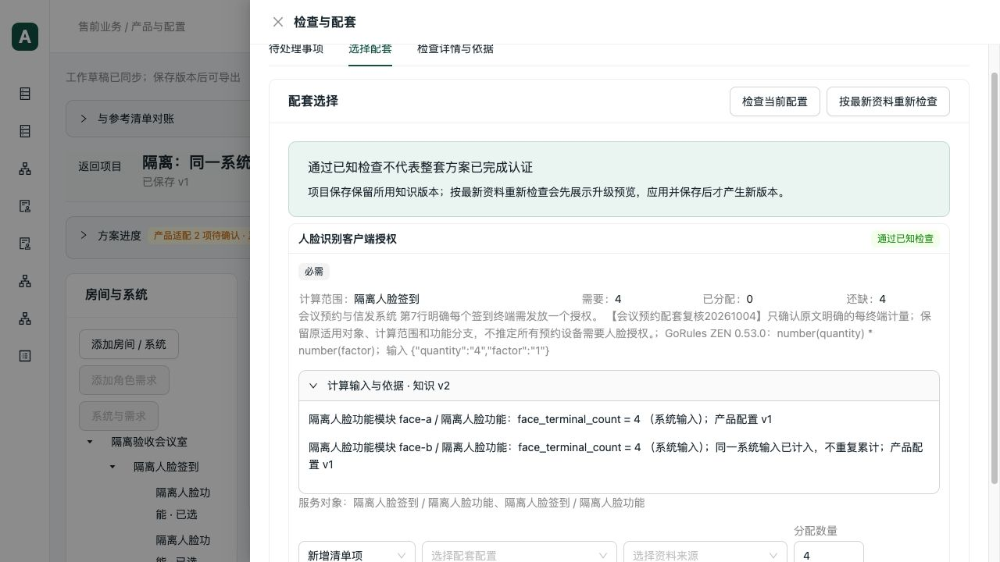

# 配套数量的范围与重复引用修复

日期：2026-10-04。接续预约资料核对，本轮修计算及证据展示；没有更新正式知识、发布资料包或改写业务数据库。

## 问题与修复

| 问题 | 复现 | 修复 |
| --- | --- | --- |
| 同一个系统输入被按设备重复计算 | 系统人脸终端数3，两台功能设备各引用一次，旧结果为6 | 保留输入所属范围和稳定ID，同一需求中的同一输入只累计一次 |
| 房间、项目范围参数没有被读取 | 参数已存在于 `room_inputs` / `project_inputs`，配套仍显示缺参数 | 按规则声明的范围读取对应字段，显式空值仍未知、零仍是零 |
| 重复贡献可能吞掉后续输入错误 | 第一处值有效，后续系统/角色值冲突，去重将错误覆盖为0 | 去重只处理有效数量；错误和冲突保留，禁止生成可应用数量 |
| 证据展示把去重误写成零输入 | 第二处显示参数为0，容易被理解为没有需求 | 原始输入与累计贡献分开保存；页面显示原值及“同一系统输入已计入，不重复累计” |

在现有 v3 公共配套计算层处理，Python 与 ZEN 共用取值及身份判断，数量公式继续通过 GoRules ZEN 0.53.0 执行。没有引入新规则引擎或默认数量。

兼容口径：

- 房间、项目有明确字段时采用对应范围；同键的角色字段属于另一范围，不覆盖它，空白也不回填。
- 没有对应范围字段的旧配置，保留现有系统/角色贡献路径；两个独立系统各填3仍合计6，两个旧角色各填3也仍合计6。
- “每设备”的两个需求分别计量；不同房间即使同名、同数量也不合并。拆分分配使用原角色身份。
- 系统与角色输入不一致延续原冲突语义，并使对应配套不可应用；单位错误、缺值仍为资料不足。
- `quantity_inputs` 兼容新增 `input_scope`、`input_scope_id`、`input_value`、`reused`、`input_conflict`；原 `value` 保留实际累计贡献。旧记录没有新增字段时，页面仍显示原记录，不伪造原始值。
- 旧计算版本1/2不改；没有数据库迁移和历史记录重写。当前工作草稿执行“检查当前配置”后获得修复后的计算证据，已保存历史结果不自动覆盖。

## 验证

先补失败回归，初始11项有8项失败。明确区分房间/项目与角色范围后完成修复，并扩充至19项专项场景；末次复核补齐缺值时的范围定位，未将缺失房间/项目字段误指向角色。

| 批次 | 结果 |
| --- | --- |
| 数量范围、公共上下文、范围需求编辑、历史配套 | 45项通过，30.93秒 |
| 数量审查、第二版配套、共享、已含交叉与重叠范围 | 36项通过，17.17秒 |
| 最终数量证据、拆分分配、版本与单位回归 | 31项通过，22.47秒，含前批重复的16项专项测试 |
| 缺值定位及专项最终回归 | 19项通过，7.93秒，含前批重复场景 |
| TypeScript检查及生产构建 | 通过；原有Univer大包提示仍存在，本轮未调整包体积 |
| 前端需求输入、角色分配和草稿操作回归 | 13项通过，无跳过 |
| Python Ruff与差异检查 | 通过 |

后端每项 `--timeout=60 --timeout-method=signal`，整批 `subprocess.run(timeout=60)`；构建也设60秒超时。

真实 stdio MCP 脚本 `scripts/verification/booking_quantity_scope.py` 使用V2.2隔离资料副本、两个独立CRIR-FC20S设备和现有人脸授权关系；设备数量仅为软件测试输入，不代表确认此业务部署方式。

- 系统输入3 → 0 → 未知 → 4，对应授权需求3 → 0 → unknown → 4。
- 两个消费角色都保留；未按型号合并设备，没有自动新增授权采购项。
- 返回真实 `GoRules ZEN 0.53.0` 计算记录；HTTP与stdio的完整issues结果一致。
- 同一写入请求重复执行返回原回执；保存v1、重开后检查结果一致。
- 最终协议项目 `a32161f5-0f74-464d-8395-a2a061f9cae3`，草稿 `80397653-94b1-47be-b69a-8d0a0142bdba`。原始报告在本机忽略目录 `data/verification/booking-quantity-20261004/protocol-final.json`。

生产构建浏览器实际操作：打开首轮协议项目，将第二个设备数量1改2，授权仍需要4；撤销后恢复1，刷新恢复草稿一致。重新检查并展开依据，两个设备均显示输入4，第二处注明不重复累计。没有点击补料或将缺少依据的系统标为通过。

网页项目 `02da0be5-4424-4a67-8246-7110db8e8c8b`，草稿 `ee910c27-252b-4a2d-aac6-ba6c2c6c17ed`，隔离网页5183/API8023。API仅访问本轮隔离SQLite。

## Review 与未验收边界

提交前自审覆盖：范围ID去重、不同范围独立计量、显式空值、单位、冲突在不同遍历顺序下保留、拆分角色身份、输入不可变、旧协议字段兼容、历史结果读取及前端证据含义。新增数量解析放在现有计算模块，未把数据库或外部调用引入纯计算。此次没有另行委托审查Agent。

本轮未重跑37项完整生成与模板导出、真实PostgreSQL并发、真实客户认证或桌面Excel/WPS重算。正式会议预约的人脸功能角色、容量、部署数量和共享依据仍有缺口；隔离项目的两个功能模块不作为新的业务规则。缺少已确认系统版本的旧文字需求，在网页系统设置中仍需先明确关联版本，不会因本次修复自动取得完整需求表单。

并行WPS改动不纳入本次提交。
