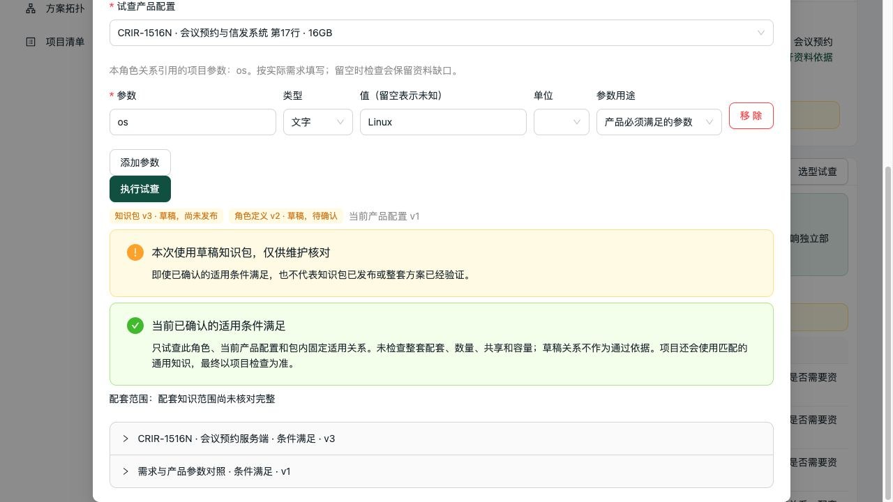

# 会议预约服务器、终端和授权核对

日期：2026-10-04。只采用已导入的 V2.2《会议预约与信发系统》来源，不代表 OA 最新资料。

## 问题分类与本轮修改

本轮主要是资料没有完整接到现有计算流程，不是 ZEN 不会算。没有重写选型架构。

| 问题 | 分类 | 处理 |
| --- | --- | --- |
| 服务器“服务端”、三种屏“预约显示终端”仍是旧文字关系，包内服务器和终端候选为空 | 知识身份映射遗漏 | 显式关联现有 `server`、`terminal` 角色并采用固定修订；保留条件和确认状态 |
| 终端软件、人脸授权有原文数量，但未填写第二版数量确认字段 | 知识维护不完整 | 只确认两条已存在的计量口径，保留适用配置及计算范围 |
| 服务器及八项定制对接服务仍有“一份”的历史公式，缺少通用数量依据 | 业务证据不足及旧记录语义不清 | 当前修订移除公式与系数，转第二版语义；历史修订保留 |
| 软件和通用授权角色默认按硬件计量 | 定义数据类型遗漏 | 分别标为 software、license，不确认角色必要性或采购量 |
| 维护预览检查原文，却未检查来源是否已重新归属配置 | 维护写入校验缺口 | 本批携带来源归属校验；应用前重新读取并锁定关联，变化则明确报错 |

原文与范围：

- 第17行 CRIR-1516N：Linux 服务器，保留既有环境条件；与普通 X86、GPU 或国产服务器不自动互换。
- 第21、22行 CSIS-B101YD/CSIS-B156YD：Android 预约屏，关联终端角色。第23行 CSIS-B215YD 原参数与备注的 PoE 冲突仍为草稿。
- 第19行 CRIR-KA20S，I19：“每个显示终端一套”。同型号跨房间的不同设备分别计算软件。
- 第7行 CRIR-CL1，F7：“每个签到终端需发放一个授权”。仅当人脸功能设备已选入、签到终端数明确时计算；不推定所有预约屏均需要人脸授权。
- 第8–15行是可选定制对接服务。单位“项”不能证明每系统固定采购一项，八条仍为可选、数量未知。
- 原服务器配套只有第17–18行相邻软硬件的依据，未明确一套软件必配一台服务器。关系改为草稿，候选保留，未更改服务器自身已有适用结论。

## 正式维护范围

通过既有维护服务原子应用 **17 条修订**：4 条适用关系、11 条配套、1 个定义、1 个草稿资料包。

- 定义 `e401b647-18ee-42b0-9f9f-120628e5b1b9`：v1 → v2，仍为草稿，四个角色 ID 不变。
- 包 `28b513aa-c06b-448d-aedd-afc5090f0733`：v2 → v3，固定定义 v2，成员由10增至15，13条关系已确认、2条草稿。
- 服务器及三种屏的关系修订分别为 v3、v2、v2、v2；终端软件配套 v3，人脸授权配套 v2。
- 人脸功能没有已核对的包内独立角色，授权关系只更新自身，未塞入包内通用“授权”角色。移动端、信发及集成服务的独立角色也未臆造。
- 无新产品、无新关系、无发布操作、无共享确认；本轮所有测试项目位于隔离 SQLite。

应用前后哈希核对：只改变17个实体、新增17份修订，其余777个实体及原1074份修订保持不变；459条来源与410条来源关联完全一致。复跑预览为0条变更。首次全量历史读取触及60秒上限，改为按实体与历史分别流式读取后完成核对，没有把超时算作通过。

维护入口：`scripts/maintain_booking_scope.py --report <报告路径>` 先进行完整校验及事务回滚预览；应用必须携带该次 `--expected-fingerprint`。一次整理后再次运行不覆盖维护者后续修改。

包内可定位缺口由30增至49：纳入了更多真实范围，同时将不存在的公式显式展开为待办，**不是新增49项采购，也不表示49个独立根因**。必须按对象和字段处理，不能为了降低数字而填默认公式。

## 验证

- 维护及来源回归75项通过，18.88秒；需求描述、包准备度、试查、数量和映射回归最终43项通过，20.81秒。两批共118项不重叠测试，包含人脸输入业务名称回归。
- 两批均设置单项60秒硬超时与整批 `subprocess.run(timeout=60)`；Ruff及差异检查通过。
- 真实 stdio MCP 与 HTTP `list_get` 完整结果一致；MCP执行了改单、幂等重试、显式升级 ZEN、保存及重开。
- 两房间相同型号的独立设备，软件需求2/3 → 2/4 → 2/3，没有按型号合并。返回引擎为 **GoRules ZEN 0.53.0**。
- 人脸数量3 → 0 → 未提供，授权需求3 → 0 → unknown；未将缺值当零，也未将授权数量由软件数量推定。
- 注册 `face_terminal_count` 的业务名称“启用人脸签到的终端数量”，用途明确为项目输入，保持原无单位数值口径；历史参数和快照不被改写。
- 服务器数量仍 unknown；八项可选对接均未选用；检查前后仍只有原先4项部署，没有自动添加配套候选。
- 固定于维护前的系统描述快照逐字段不变；新资料只有新草稿采用。
- 浏览器实际试查预约服务器 Linux 条件满足；HTTP额外核对 Windows 冲突、10.1寸 Android 条件满足、21.5寸仍未知。
- 浏览器显示包v3、定义v2均为草稿，并提示配套覆盖未核对完整，未以绿色适用结果冒充整套认证。

协议入口：`scripts/verification/booking_scope.py`，要求提供维护前的隔离 SQLite 副本、隔离 HTTP API、产物目录和报告路径；脚本设60秒硬超时。第一轮发现测试脚本跨事务访问已释放 ORM 对象，第二轮修正引擎名称断言，第三轮完整通过；失败没有作为通过计入。

隔离项目 `c1d8864b-26e7-4f9a-8ee7-c3492a016e89`，草稿 `6b725547-6fdf-4696-8a18-fd141980b8bc`；原始预览、应用和协议回执在忽略目录 `data/verification/booking-scope-20261004/`。

## Review 与边界

代码复核覆盖来源行唯一性、配置范围、引文存在性、修订冲突、事务应用、后续重放、原状态保留及历史保护。未发现本批剩余阻断性问题；适用映射不会确认草稿，数量确认不会添加设备，普通配套不强制绑定角色，包成员只能由本批明确选择。

本轮没有更改前端应用代码，未重复前端生产构建；浏览器使用上轮通过构建的现有页面验证新数据。没有重跑37项全部报价导出、真实 PostgreSQL 隔离并发、真实客户认证或桌面 Excel/WPS 重算。

仍缺：服务器部署数量和业务容量、人脸及其他扩展功能的角色必要性、普通终端接入授权边界、推荐顺序、共享部署依据及21.5寸供电冲突的澄清。当前结果不能称为“会议预约整套方案已完整验证”。
