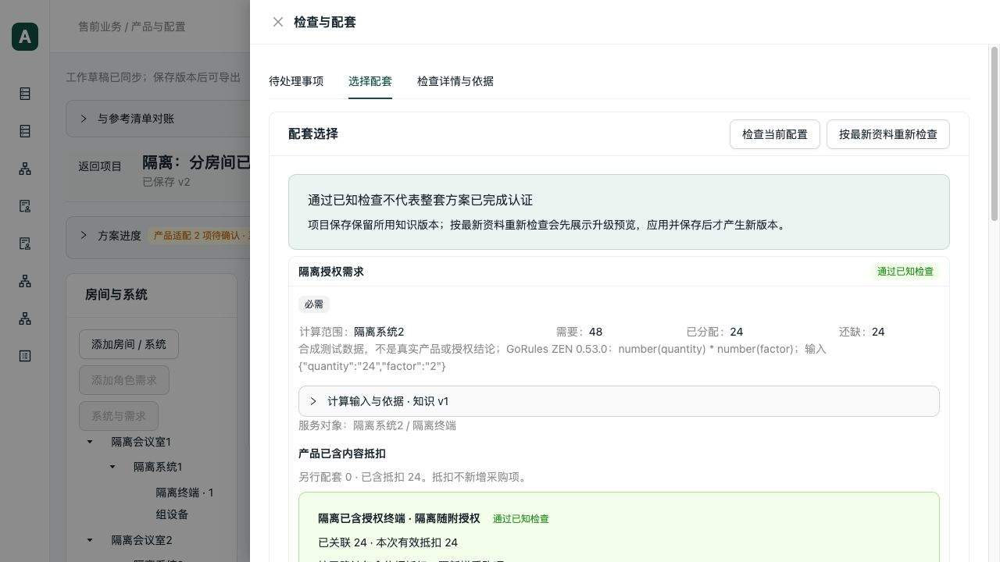

# 已含内容按房间分配回归

日期：2026-10-04。基线 `d869d1b`。本轮继续检查分布式多房间清单的已含配件、软件及授权抵扣，实际验收使用明确标注的合成授权和隔离数据库，不新增真实业务授权结论。

## 缺陷与修复

同一批 32 台设备分给两间房，分别明确分配 8 台、24 台，每台已含一份授权。第一间的配套需求为 16 份。旧计算把整批 32 份都作为第一间可用数量，允许抵扣 16 份并将缺量算为零。

先补三个失败回归，分别复现可用数量错误、检查错误通过和编辑接口错误接受。修复将“已含数量”绑定到本需求实际分配的宿主设备数量，并同时检查宿主整批总量。相同宿主及相同明确分配范围内的多个需求合计占用，不允许各自重复抵扣。

- 第一间最多抵扣 8 份，剩余 8 份继续显示缺量。
- 第二间最多抵扣 24 份，第一间不能借用其已含内容或未分配库存。
- 第一间分配从 8 减至 4，旧 8 份抵扣保留并报冲突，有效抵扣为零；不静默删减原记录。
- 解除用途后，旧抵扣显示需求已变化，不能继续满足已消失的需求。
- 客户已有设备保留已含抵扣能力，采购仍为零。
- 项目级、设备级汇总按实际宿主总量计入；环境数量参数不冒充宿主设备数量。
- 已含数量未知、配置修订变化、缺少包含依据、全局重复占用继续沿用原检查。

新增纯计算对象 `IncludedCapacity`，在一次检查内复用宿主数量与占用数据。配套数量仍由实际 GoRules ZEN 计算；Python 检查已含数量归属与占用，Decimal 保持数量精度。接口兼容增加范围容量和范围已分配数量，没有新增数据库字段或改写已保存快照。

代码复核覆盖：计算临时角色 ID 到实际分配的对应、同一范围重复引用去重、总量与范围数量双重检查、旧字段语义、缺失事实及修订变化、公共编辑与方案生成共用的 `included_offers.available`。本轮修复针对明确的角色数量分配，不推测未声明的授权跨设备转移能力。

## 验证结果

| 验证 | 结果 |
|---|---|
| 已含抵扣、修改核对、部分复用、配套范围与新回归 | 57 项通过，16.48 秒 |
| 分布式资料维护、容量分配、用途检查、ZEN 执行和组合规则 | 109 项通过，24.38 秒 |
| 前端表单、草稿、工作表和数据投影 | 91 项通过，1.80 秒，无跳过 |
| TypeScript、生产构建、Python lint | 通过；原 Univer 大包提示仍存在 |

新增 9 项后端测试。后端每项 `--timeout=60 --timeout-method=signal`；每批外层 `subprocess.run(timeout=60)`。真实协议脚本采用 60 秒硬超时。

真实 stdio MCP 与 HTTP 完成：建立两房间 → 查询 8/24 可抵扣数量 → 超额 16 份被拒绝且草稿未变 → 接受 8 份 → 重试无重复 → 减量产生冲突 → 检查点恢复 → 保存 v1 → 重开。协议结果相同。

浏览器实际操作第二间抵扣：显示剩余 24；输入 25 时按钮不可提交，改为 24 后成功应用。保存 v2 并刷新，仍显示第二间需 48、已抵扣 24、缺 24，第一间需 16、已抵扣 8、缺 8。HTTP 与真实 stdio 再读取 v1/v2：v1 仅原 8 份，v2 为 8/24，两入口一致，旧修订保留。

协议脚本：`scripts/verification/included_partitions.py`。最初一次验收脚本遗漏 MCP 必填的清单类型，被明确拒绝；补齐 `kind=hardware` 后完整流程通过，没有修改接口默认行为来掩盖脚本错误。

## 隔离与完成边界

- 隔离库：`data/verification/included-regression-20261004/isolated.sqlite`。
- 完整回执：同目录 `stdio.json`、`browser-readback.json`。
- 浏览器：5182/API8022；项目 `637896f8-cef8-4fa6-aa7a-e097c2e4aabf`，草稿 `91a211af-16de-4a6f-84fc-0441e2ed1102`。
- 原 5181 项目、正式知识、价格、工作簿及并行 WPS 修改未纳入本次变更。
- 本轮没有重做完整 37 项导出；前轮结果保留在 `regression-followup.md`。本轮不宣称真实授权关系已确认或完整业务方案已通过。
- 未执行真实客户验收、真实 PostgreSQL 并发及桌面 Excel/WPS 显示重算。
