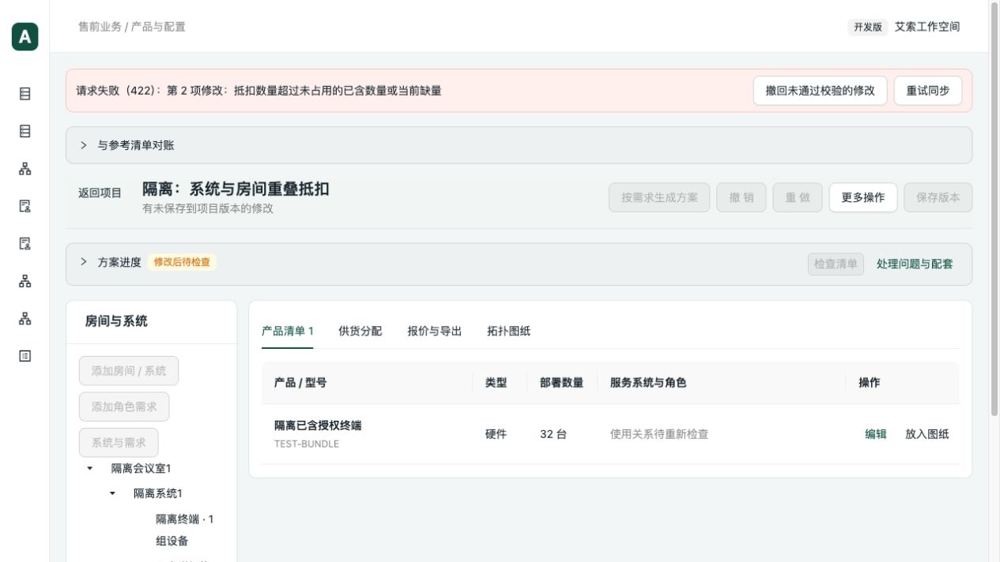
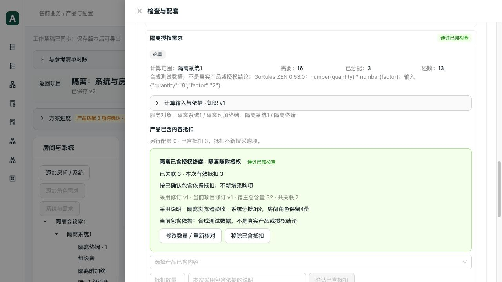

# 嵌套范围抵扣与失败恢复回归

日期：2026-10-04。基线 `797fb87`。继续验证多房间清单中的已含配件、软件及授权抵扣。本轮使用隔离合成授权，不把测试关系写入正式知识。

## 复现与修复

### 系统与房间重复占用

同一批 32 台设备分别分给第一间的两类角色（4＋4 台）及第二间角色（24 台）。每台已含一份测试授权。第一间的系统级需求覆盖两类角色，房间级需求只覆盖其中一类。

旧实现按完全相同的角色集合分别检查，导致系统需求抵扣 8 份后，房间角色还能抵扣 4 份；整批 32 份没有超量，但第一间实际只有 8 份。先补回归，首次 4 项失败、1 项通过。

修复按宿主及已含项归集占用，同时检查已知的包含范围：

- 系统用完 8 份，下面的角色可用数量为 0。
- 角色先用 4 份，系统最多再用 4 份；第二间仍可使用 24 份。
- 同时保留整批数量与当前需求范围数量检查，使用 Decimal 处理小数。
- 减量后保留原抵扣记录并显示冲突，不静默删除、不借用无关房间的数量。
- 编辑校验失败时原子回滚；移除、重试及检查点恢复后重算占用。

配套需求量仍由真实 GoRules ZEN 0.53.0 执行；宿主归属和已含占用由 Python 处理。本轮覆盖已知的嵌套范围与独立房间，没有增加通用分配求解器；任意交叉集合的分配不在本轮验收范围。

### 处理入口误指向无关角色

真实协议验证发现：第一间抵扣冲突的处理动作包含了第二间角色。先补失败用例，再修复动作投影，优先使用检查明确指定的角色，其次使用配套需求实际消费者；只有设备级问题才沿用全部使用者。

现在系统级冲突关联第一间两类角色，房间角色冲突只关联该角色。网页与 MCP 返回的对象列表一致，不需要解析提示文字。

### 网页校验失败后只能反复重试

浏览器提交系统抵扣 8 份（房间角色已占 4 份）时，后端正确拒绝，但页面保留无效本地修改并禁用编辑、撤销，仅显示“重试同步”。

增加明确的“撤回未通过校验的修改”：仅在服务端 422 明确拒绝当前这份本地内容时提供，用户点击后恢复已同步草稿，不产生新写入。错误本身不会自动丢弃输入。断网、响应丢失、409 并发冲突及拒绝后又发生的其他本地变化不会被这个入口丢弃，仍保留原有重试或冲突处理。

新增两个状态回归，并加强断网/响应丢失测试；改动前相关断言失败，修复后通过。恢复动作复用现有草稿投影及检查结果，不新建数据存储或接口。

## 验证结果

最终修改后的后端三个批次不重叠，共 188 项；前端 93 项，无跳过。

| 范围 | 结果 |
|---|---|
| 已含内容、嵌套范围、抵扣核对、部分复用、配套计算 | 66 项通过，20.73 秒 |
| 用途检查、方案价格与循环、网页草稿及边界 | 24 项通过，8.13 秒 |
| 分布式资料维护、分房间容量、ZEN 执行和组合规则 | 98 项通过，18.31 秒 |
| 前端表单、草稿、失败恢复、工作表及投影 | 93 项通过，1.64 秒 |
| TypeScript、生产构建、改动 Python lint | 通过；既有 Univer 大包提示仍存在 |

新增 9 项后端测试。后端每项 `--timeout=60 --timeout-method=signal`，每批 `subprocess.run(timeout=60)`；前端测试及构建也分别设置 60 秒外层超时。协议脚本使用 `signal.alarm(60)`。一次后端调用误填了测试目录，没有执行测试；改用实际 `scripts/paperless_review` 后以上 98 项通过，该失败调用未计入通过。

真实 stdio MCP 与 HTTP 流程：建立嵌套角色 → ZEN 检查 → 系统抵扣 8 → 房间再抵扣 4 被拒绝 → 改为 4＋4 → 幂等重试 → 角色减量产生两项冲突 → 核对真实角色 ID → 检查点恢复 → 保存 v1 → 重开。两入口结果相同。

真实浏览器流程：

1. 从 v1 的系统 4＋房间 4 开始，把系统改为 8；明确显示 422，服务端原关联不变。
2. 点击撤回后恢复 4＋4，页面可继续编辑，无需刷新。
3. 把系统改为 3，房间仍为 4；有效抵扣合计 7，系统缺量 13。
4. 撤销恢复 4＋4；HTTP 读取草稿修订 11 确认。重做为 3＋4，保存 v2 并刷新重开。
5. 再由真实 stdio 与 HTTP 读取 v1/v2：v1 仍为 4＋4、系统可用 0；v2 为 3＋4、系统可用 1；第二间仍可用 24，未被误占。

## 复核与交付边界

人工代码复核覆盖：包含范围累计、独立房间隔离、Decimal 数量、无数量依据的既有语义、消费者 ID、编辑事务、幂等重试、前端拒绝恢复与不确定请求保护。未发现本轮改动范围内新的阻断问题。

前端原有项目页和草稿 Hook 已较长；本轮只增加错误操作入口与对应状态，未混入新职责或为满足行数机械拆分。计算仍封装在既有 `IncludedCapacity`，问题角色投影抽为小函数；没有改公共 API、增加依赖或改写数据库。

- 协议入口：`scripts/verification/included_overlapping_scopes.py`，参数同现有隔离验证入口。
- 隔离库：`data/verification/included-overlap-20261004/isolated.sqlite`。
- 原始回执：同目录 `stdio.json`、`browser-undo.json`、`browser-readback.json`、`frontend-checks.txt`，不提交数据库。
- 项目 `98d4acf8-214d-4ceb-afce-bf2cdab51ebd`，草稿 `f0af7c21-7a11-4d7e-b1ce-18e5ccc60a5c`；网页 5182/API8022。
- 原 5181 项目、正式知识、真实价格及原始工作簿未修改；并行 WPS 改动不纳入提交。
- 本轮没有重跑完整 37 项导出、真实 PostgreSQL 并发或桌面 Excel/WPS 重算；真实授权、兼容与共享依据仍按既有缺口维护，不因本轮软件测试通过而自动确认。
