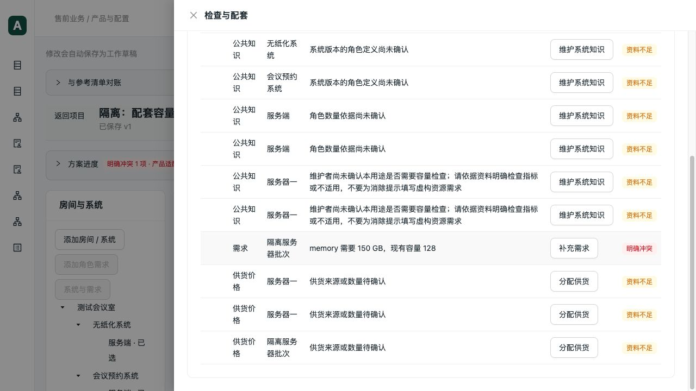
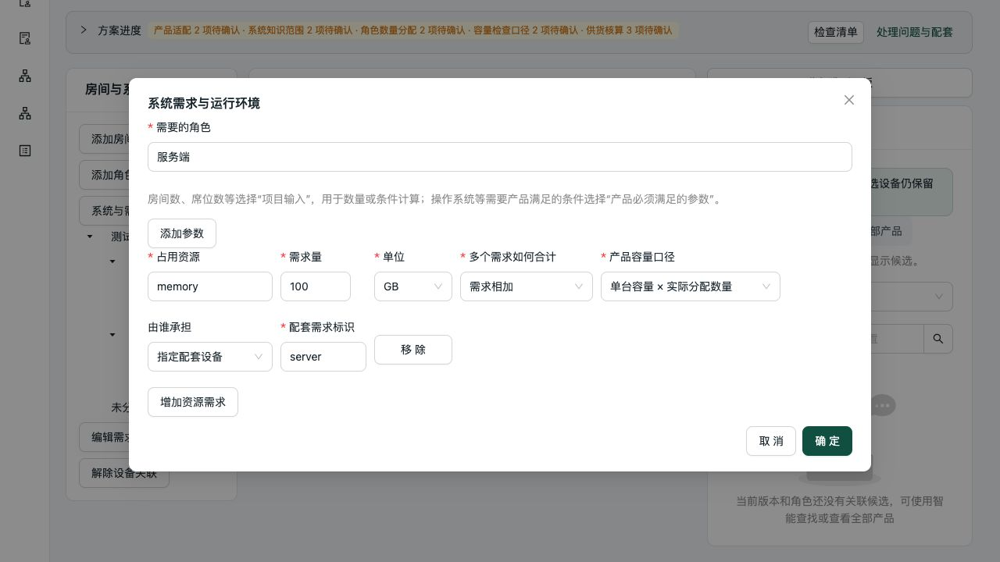
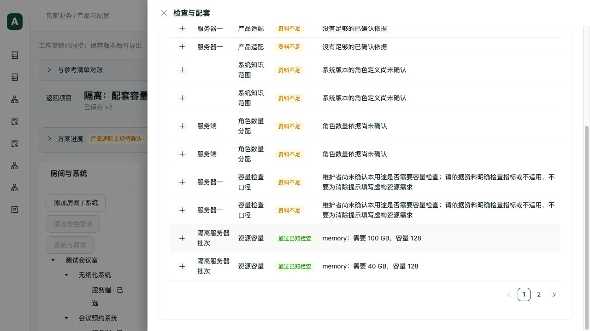

# 配套分配容量与资源表单验收

日期：2026-10-05。代码基线 `043cb42`，承接 `ede28c2` 的数量分配检查。范围为独立配套数量的容量计算和网页资源需求编辑；未修改正式数据库或真实知识。

## 已复现的两项缺陷

### 独立分配误用了整批容量

隔离配置包含三台、每台 128 GB 的服务器，其中两个系统各分配一台，分别需要 150 GB 和 40 GB。原结果以 `190 <= 384` 判为通过，借用了未分配设备和另一系统的容量。

新增失败回归：4 失败、2 通过；Python-v3 和 ZEN-v1 都能复现。修复后分别返回 `150 > 128` 冲突、`40 <= 128` 通过。

- 对纯数量消耗的配套用途，先按设备及需求汇总分配量，再按需求组织资源检查。同一需求下多个消费者共享该项分配数量，容量只计一次。
- 只有明确使用“单台容量”口径时才分组；“部署整体容量”维持既有口径。单位、合计方式或容量范围互相矛盾仍明确报错。
- 未分配的设备不提供容量。增加批次数量而不增加用途分配，不改变容量结论；把某需求的分配从 1 改为 2，才从 128 增至 256。
- 资源结果兼容增加需求 ID 和分配量，处理动作定位到真实角色。不会修改设备数量、配套分配、采购、价格或知识快照。
- 真正共享、混合直接用途继续沿用实例共享检查；超量分配与容量依据检查保持独立。

### 仅修改需求量却丢失了计算口径

真实浏览器将需求量 150 改为 100 后，Ant Design 的已注册字段提交遗漏 `capacity_basis` 和 `aggregation`，后台把口径默认回“部署整体容量”，与另一系统的单台口径发生冲突。

新增两项表单回归确认字段丢失后修复：提交读取当前完整表单状态，保留嵌套行已有字段；不按旧数组索引拼接。表单显式展示“多个需求如何合计”和“产品容量口径”，新增行沿用后台已有默认语义。补齐前端类型，调整现有网格宽度，完整展示容量口径文字。

## 验证

| 范围 | 结果 |
| --- | --- |
| 配套容量分区、直接分区、数量分配、共享、用途检查、配套需求 | 58 通过，16.12 秒 |
| 候选输入、共享上下文、ZEN 执行链、方案生成/保护/真实协议、数值一致性 | 53 通过，28.59 秒 |
| 隔离浏览器数据库准备 | 1 通过，0.55 秒 |
| 最终容量相关复验，包含上述 27 项 | 27 通过，13.45 秒；不重复计数 |
| 表单数据往返、数量动作、草稿操作、角色分配 | 15 通过，0.87 秒 |
| 最终 TypeScript 与生产构建 | 通过，6.36 秒；既有 Univer 大包提示保留 |
| 本轮 Ruff 与 diff 检查 | 通过 |

后端共 **112 个不同测试通过**，每项 `--timeout=60 --timeout-method=signal`，每批 `subprocess.run(timeout=60)`。协议脚本使用 `signal.alarm(60)`。补充覆盖 max/sum、同一需求多个角色、分片分配、小数、源设备角色分配量不能当作服务器量、不同单位、容量未知及真实对象 ID。

### 真实 stdio MCP / HTTP

全新隔离库：`data/verification/accessory-capacity-20261005/isolated.sqlite`。产品和容量均来自明确标记的测试夹具，不是艾索产品能力结论。

入口：`scripts/verification/accessory_capacity.py`；数据库准备入口为 `test_accessory_capacity_protocol.py`，可显式设置 `CAPACITY_BROWSER_FIXTURE`，拒绝覆盖已有文件。准备脚本最初误读保存响应的 `checked` 字段，协议脚本最初遗漏补料前的显式检查；两处测试编排错误修正后才得到下面的通过结果。

协议项目 `aeee19bd-3e66-4dd5-ab13-8117673dfbc7`，草稿 `a11f6dc4-aebb-452c-a76d-89f3e4180653`：

1. 读取两个系统容量冲突/通过结果，HTTP 与真实 stdio MCP 完全一致。
2. 批次数量从 3 增到 5，未增加用途分配，容量结果保持不变。
3. 测试项目第一系统需求从 150 改为 100 后通过；同幂等键重复调用不重复修改。
4. 删除服务器批次后，两个系统各重新缺 1 台。重建并明确关联各 1 台，恢复原数量及容量结论。
5. 保存 v2、读取 v1/v2，v1 仍为 150 GB 冲突，v2 为 100 GB 通过。
6. 导出隔离设备清单，产物 `991ee47a-2beb-57a6-8fdd-309588031d81`，文件存在。另有既有真实提案协议测试覆盖模板报价导出。

### 真实浏览器

项目 `663b94e4-3f19-4e08-842d-e2148393d9ad`，草稿 `e986a7cb-27dd-425a-a4fa-c84df533bea5`，运行于隔离 API 8024 / 生产构建预览 5184。

- 问题页准确显示 `150 GB / 128 GB`，补充需求只指向受影响的无纸化角色。
- 编辑为 100，原合计方式、单台口径、配套目标均保留；设备和分配不变。
- 撤销恢复 150 及冲突，重做恢复 100；保存 v2、刷新、再次打开表单均保持。
- 真实 MCP 再次读取浏览器的两个版本，并与 HTTP 对账；v1/v2 与网页结果相同。其他资料与供货缺口没有被消除。

本机完整协议报告与构建日志位于忽略目录 `data/verification/accessory-capacity-20261005/`。

## Review 与完成边界

- 新容量投影为纯计算，外部效果仍由原业务服务负责；分配索引一次构建，不逐需求查询数据库。没有新增依赖或修改公开工具名称。
- 资源分组在单位/口径一致性检查之后，数量采用 Decimal；未加入默认容量、单位换算或失败降级。
- 简单表单使用当前行状态，删除、清空、改变顺序不会取回已删除的旧资源；角色和设备身份保持不变。计算口径可见，不再靠隐藏默认值改变含义。
- 同一共享检查和最终计算继续供网页及 MCP 使用。大计算文件只调整容量投影调用，新增分配投影放入所属 calculation 模块，没有机械拆文件。
- 提交前自查未发现阻止提交的问题。并行 WPS 文件与其他未跟踪产物排除在此次提交之外。

本轮解决软件缺陷，不确认真实服务器容量、共享或兼容性。未重跑完整 37 项真实参考清单、真实 PostgreSQL 并发、真实客户认证和桌面 Excel/WPS 显示重算；这些不计入本轮通过结论。
