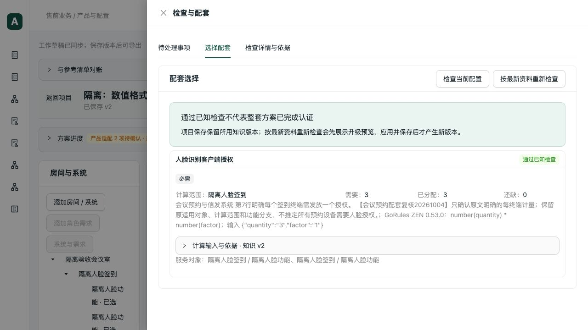

# 数量表达与配套分配后续验收

日期：2026-10-05。起始代码基线 `acd17ed`，上一轮数量补填提交 `b4330eb`。本轮只修复软件计算与问题投影，未修改正式产品、知识或项目数据库。

## 复现与修复

1. **同值需求产生冲突。** 系统填 `3`，角色填 `3.00`，数量解析与用途检查分别以字符串比较，产生虚假冲突。提取共享比较函数：同单位、已验证的数值属性用 Decimal 比较，保留原始文本。文字版本、枚举、不同单位及未知与零仍按原含义区分。
2. **缺量为零仍出现在方案问题中。** 需求为 3、分配为 `3.00` 后缺量为 `0.00`，提案只识别字符串 `0`。改为数值零判断；只有需求检查通过且明确缺量为零才移除该问题，`0.001` 的真实缺量继续保留。
3. **数量分配误触发共享主机检查。** 同一系统两个软件消费者对应一项 3 份授权需求，分配后被当作多人共用一台服务器，因设备数量不为 1 而冲突。使用现有 `allocation_mode` 区分数量消耗与实例共用：纯数量分配保留数量占用检查；共享或直接角色用途继续执行共用检查。不根据产品名称或清单类型猜测。

首次数值回归为 8 失败、4 通过；补充整套项目检查断言后再次暴露 6 个用途检查冲突。浏览器实际补料后发现第三项问题，新增回归为 3 失败、3 通过。所有失败均完成修复，没有通过改业务知识隐藏错误。

## 自动验证

| 范围 | 结果 |
| --- | --- |
| 数值一致性、数量动作、数量范围、共享计算上下文 | 49 通过，24.22 秒 |
| 用途检查、候选输入、ZEN 执行链、方案生成与保护 | 42 通过，25.69 秒 |
| 数量分配、共享、资源分区、配套需求、清单边界 | 38 通过，16.14 秒 |
| 补充跨系统数量池、真实提案协议 | 9 通过，10.85 秒 |
| 前端数量动作与草稿投影 | 11 通过，0.48 秒 |
| TypeScript 与生产构建 | 通过，5.36 秒；既有 Univer 大包提示保留 |
| 本轮 Python Ruff、格式与 diff 检查 | 通过 |

后端四批共 138 次执行，最后一批重复其中 6 项，合计 **132 个不同测试通过**。每项 `--timeout=60 --timeout-method=signal`，每批 `subprocess.run(timeout=60)`；协议脚本 `signal.alarm(60)`。

新回归还覆盖：Python-v3 与 ZEN-v1、未知/零/小数、单位冲突、文字软件版本、真实缺量、共享硬件、混合直接用途、重复分配，以及两个系统各分配 3 份、数量池从 6 减到 5 后出现超量冲突。容量和资源依据检查未被关闭。

## 真实 MCP、HTTP 与浏览器

隔离库：`data/verification/booking-decimals-20261005/isolated.sqlite`，来自此前 V2.2 验收副本。两个 CRIR-FC20S 软件消费者仅用于测试输入与分配流程，不代表确认真实部署需要两个模块；没有新增测试兼容、共享、容量或价格结论。

可重复入口：`scripts/verification/booking_decimal_consistency.py`。

- 默认流程：真实 stdio MCP 创建、提交需求、启用 ZEN 检查、读取候选、选择 `3.00` 份 CRIR-CL1、重复原幂等请求、生成提案、保存和读取；每次问题查询与 HTTP 对账。
- `--prepare-only`：保存尚未选配的项目 v1，供浏览器实际操作。
- `--project-id`：读取浏览器保存前后的 v1/v2，与 HTTP 对账。
- 参数沿用隔离数据库、产物目录、报告位置、API 与网页地址。脚本不替调用者配置正式数据库。

协议项目 `04691155-19aa-4965-9672-56bd3d5c1036`，草稿 `1804f857-c9bb-4471-bc08-6d166dddd3c9`。结果：需求 `3`、已分配 `3.00`、缺量 `0.00`，三项设备，HTTP/stdio 相同；提案没有虚假输入或配套缺口，重复调用未加料。真实提案协议回归还运行隔离模板导出及进程重启读取。

浏览器项目 `7f070648-a3be-4805-9faf-a39cf90e685c`，草稿 `ee24f6e9-4485-4be8-a9ac-91b708f091d4`：

1. 实际打开生产构建，选择 CRIR-CL1，填入 3 份，供货明确保留待确认。
2. 撤销恢复两项设备和缺量 3；重做恢复三项设备及已满足数量。
3. 保存 v2、刷新重开，再由真实 MCP 与 HTTP 读取：v1 两项设备、缺 3；v2 三项设备、缺 0。旧版本保持不变。
4. 页面显示 GoRules ZEN 0.53.0，`number(quantity) * number(factor)`，输入数量 3、系数 1。真实角色、兼容、容量适用和供货缺口继续显示。

本机原始报告位于忽略目录 `data/verification/booking-decimals-20261005/{protocol-final,browser-readback}.json`。前端构建日志在同目录 `frontend-build.log`。

## 提交前 review 与边界

- 数值比较只接受现有 schema 验证后的属性；不增加静默转换、单位换算、舍入或失败降级。
- 共享判断读取全部用途，不先按角色去重后丢失混合的直接/共享用途；数量过量、容量和依据检查仍独立执行。旧 v1/v2 设备检查路径未调整。
- 新比较函数放在既有计算模块；现有大文件只改相关比较或用途字段，没有为行数机械拆分。未增加依赖、数据库字段或工具名称。
- 本轮自查未发现阻止提交的问题；并行 WPS、红盾整理及其他未跟踪产物不纳入此次提交。

本轮未重新执行完整 37 项实际案例、真实 PostgreSQL 并发、真实客户方案认证或桌面 Excel/WPS 显示重算。隔离协议导出通过不能替代这些验收，也不代表整套真实搭配已经确认。
