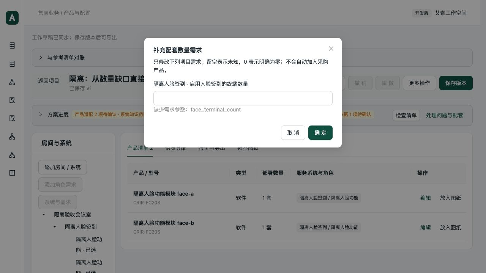
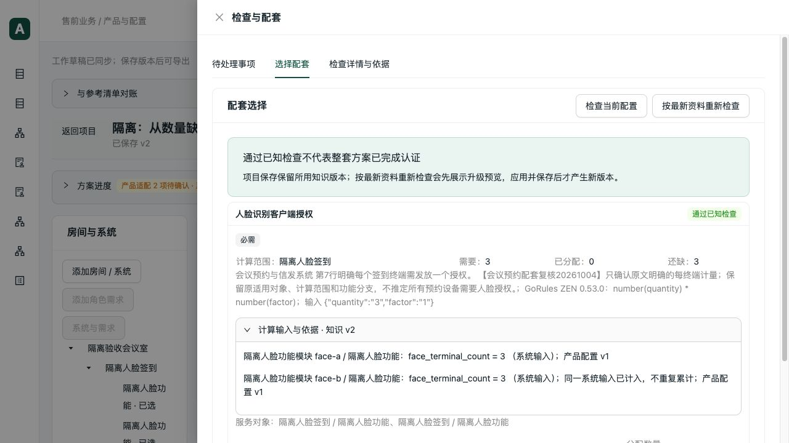

# 配套数量需求补填验收与 review

日期：2026-10-05。基线：`8ad85ae`。本轮继续上一轮数量范围检查，未修改正式产品、知识或项目数据库。

## 已复现问题

人脸客户端授权已有按终端数计量的依据，但项目未填 `face_terminal_count` 时，方案提案与网页把它当作内部知识缺口。售前点击后只能去搭配维护，不能直接填写对应系统需求。

新增回归在修改前为 3 失败、1 通过；失败覆盖作用范围、问题分流、显式零值。

## 修复

- 配套检查新增结构化输入问题：缺值、无效值、单位不符、系统与角色值冲突。保留范围 ID、业务名称、单位及全部消费者，不解析提示文字决定入口。
- 多设备共用同一系统输入时只生成一个补填事项。房间、项目和历史角色输入各自定位；拆分分配仍定位原角色。
- 项目输入问题与未确认知识分别展示。数量依据仍为草稿、兼容条件未知或存在循环时，内部维护事项不会因出现补填入口被隐藏。
- 网页“补填数量需求”沿用草稿业务编辑、重新检查及一次撤销；保留未知与零的区别。单位变化要求手工核对，不自动换算。
- 方案生成的问题与最终检查共用输入问题投影；MCP 工具名称、原文字字段及旧记录兼容行为保留。
- 方案进度将统称“配套依据”的提示改为“配套需求或依据”，避免把缺输入全都理解成知识维护。

## 验证结果

| 验证 | 结果 |
| --- | --- |
| 数量动作、作用范围及历史配套回归 | 47 通过，14.48 秒 |
| ZEN 执行链、方案生成、保护、价格循环及网页草稿边界 | 33 通过，19.24 秒 |
| 前端输入投影与草稿操作 | 11 通过，0.25 秒 |
| TypeScript 与生产构建 | 通过；保留既有 Univer 大包提示 |
| 本轮 Python Ruff 与 diff 空白检查 | 通过 |
| 真实 stdio MCP、HTTP、提案提问、保存读取 | 通过 |
| 生产构建浏览器补填、撤销、重做、保存、刷新 | 通过 |

后端每项使用 `--timeout=60 --timeout-method=signal`，每批由 `subprocess.run(timeout=60)` 限时；协议脚本使用 `signal.alarm(60)`。上述两批 80 项互不重复，不将此前重跑次数计入测试数。

隔离库：`data/verification/booking-inputs-20261005/isolated.sqlite`，来自上一轮 V2.2 验收副本。两个 CRIR-FC20S 模块是测试消费者，不代表确认实际部署需要两个模块；没有加入测试兼容、共享或价格结论。

协议项目：`7af28c01-c31d-43fa-943f-eb399f0af86c`。草稿：`71210bbe-3597-45f5-8535-c235543fab2a`。

1. MCP 读取缺值结果，与 HTTP 相同；提案仅针对这一输入返回一个客户需求问题，含两个消费者。
2. 网页打开“补填数量需求”，输入 3；ZEN 0.53.0 按 `number(quantity) * number(factor)` 得到 3 份授权。同一系统第二个引用不再累计。
3. 撤销恢复未知及补填入口；重做恢复 3。清单始终仅有两个原测试模块，没有自动采购授权。
4. 保存 v2 后刷新，仍显示需要 3、已分配 0、还缺 3。
5. 再由真实 stdio MCP 与 HTTP 读取保存版本：v1 仍为未知，v2 为 3；均为两项设备，结果一致。

原始协议与读取报告存于本机忽略目录 `data/verification/booking-inputs-20261005/{protocol,browser-readback}.json`。可重复验证入口：`scripts/verification/booking_input_actions.py`；不带 `--project-id` 建立隔离场景，浏览器保存数量为 3 的 v2 后可带项目 ID 对账历史版本。

## 提交前 review

- 已核对计算、提案问题和网页待办的字段契约；仅输入有误时才省略笼统知识问题，混合缺口保留两类问题，并通过真实草稿数量依据的回归验证。
- 只更新所指作用范围；其他字段、同名房间、未知和零、原对象均保持，目标已删除时显式报错，整批不部分应用。
- 不改公式、数量计算语义、公开工具名或历史快照；后台仍校验原操作与草稿修订。新增模块按输入问题投影、表单编辑边界拆分，未机械拆分现有项目页或计算编排。
- 本轮自查未发现阻止提交的问题；并行 WPS 改动不在提交范围。

## 完成边界

本轮解决的是软件流程问题。真实人脸功能角色、容量、部署及共享知识仍待确认，不能因授权计量正确宣称整套系统已验证。未重跑 37 项完整生成与模板导出、真实 PostgreSQL 并发、真实客户方案认证或桌面 Excel/WPS 重算。
