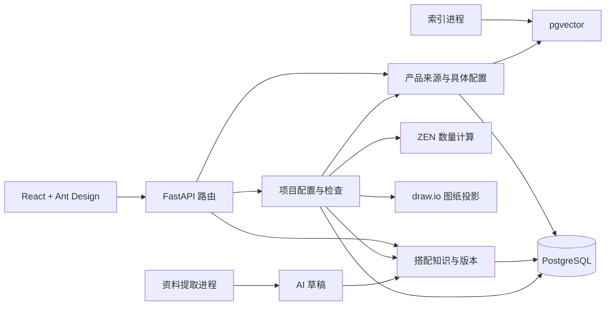

# 售前平台架构评审（2026-09-26）

## 结论

当前阶段继续采用**模块化单体**最合适。产品来源、产品配置、搭配知识、项目配置、清单和拓扑需要在同一事务中保持一致，拆成微服务会增加分布式事务、版本同步和部署复杂度，却不能解决当前主要问题。

平台的核心边界已经基本正确：

- 产品来源是证据，产品和具体配置是稳定业务身份。
- 搭配知识描述适用、配套和共享条件，不直接替代产品主数据。
- 项目配置是业务事实来源；清单和拓扑是同一配置的不同投影。
- Python 负责候选、条件、共享和分配语义；ZEN 只执行数量公式。
- AI 只生成待审核草稿；语义搜索只召回和排序，两者都不决定兼容性。

## 本轮已优化

1. 产品配置装配将来源链接按配置一次分组，避免每个配置重复扫描全部链接。
2. 产品整理的匹配候选按型号预建索引，避免每条未整理来源重复扫描全部配置。
3. 项目检查复用单个快照解析器，并按设备预分组系统需求，减少重复数据库对象创建和列表扫描。
4. 前端统一复用知识查询 Hook；系统类型、角色输入和知识页面共享同一 React Query 缓存。
5. 项目树提取为纯函数，按房间、系统和需求一次建立索引，并只在相关配置变化时重新计算。
6. 增加统一设备使用投影，角色直连和配套分配共用一条检查、清单和展示路径，避免服务器已被配套使用却显示未分配。
7. 前端 Query Key 集中定义；知识、来源和项目写入按对应命名空间精确失效。
8. 产品整理页已拆出来源核对表、产品/配置表和修订弹窗；项目编辑器已拆出工具栏、系统树、设备表、待确认面板和各类表单。
9. 候选、检查、应用配套、保存与重开已有固定 API 契约测试；属性键由统一定义接口提供类型、单位和别名。

这些调整保留旧接口、知识语义、项目版本和历史数据。

## 需要保持的模块边界

### 产品目录

`catalog/` 保存原始导入和核对事实，`configuration/catalog/` 维护产品、配置与来源归属。两者暂时并存合理：前者面向不可修改的证据，后者面向售前使用的主数据。不要把原始 Excel 行直接当成唯一产品，也不要让知识规则直接引用型号字符串。

### 旧清单、旧规则与统一配置

`projects/`、`rules/` 是旧流程，`configuration/projects/`、`configuration/knowledge/` 是统一流程。迁移完成前应继续通过显式导入和适配层连接，禁止两个流程同时修改同一个新项目。等真实项目全部迁入后，再删除旧写入路径，保留只读历史查询。

### 数量、兼容与优化

兼容判断和数量计算应继续分开：

- 兼容判断：结构化条件和 Python evaluator。
- 数量计算：明确输入后交给 ZEN。
- 多方案最优选择：只有在产品、约束和成本数据稳定后再考虑 OR-Tools。
- LangChain/LangGraph：当前主流程不需要；资料提取已有明确的模型适配器和任务状态。

## 上线前优先级

### P0：企业使用前必须完成

1. **身份与权限**：维护人不能继续由表单自由填写。接入公司身份源，至少区分产品维护、知识审核、售前使用和管理员，并从登录身份生成审计记录。
2. **数据库迁移**：当前显式迁移脚本适合开发期，正式部署前应采用带版本号、可回滚或有恢复说明的数据库迁移流程，禁止启动时隐式改变正式库结构。
3. **备份与恢复验证**：定期备份 PostgreSQL、模型私有配置和原始资料索引，并实际演练项目版本与知识版本恢复。
4. **后台任务租约**：资料提取和搜索索引需要任务领取时间、心跳、超时回收和单任务互斥，服务中断后要能准确标记中断或重新领取。
5. **操作日志**：记录请求标识、项目、知识版本、任务标识和错误类型；日志不能包含密钥和完整敏感资料。

### P1：产品量和项目量增长前完成

1. **拆分配置列表与详情接口**：当前配置列表携带全部来源参数，数据量扩大后响应会过大。列表只返回型号、名称、状态和来源摘要，详情按需加载原文和参数。
2. **为常用投影建立索引或实体列**：`Entity.payload` 适合版本快照，但系统、角色、状态和项目 ID 等高频筛选字段长期应有数据库索引或单独投影表。
3. **索引失效事件**：配置确认或变更后明确标记搜索文档过期，避免依赖人工发现并重建索引。
4. **配置性能基线**：使用真实规模的产品和知识数据记录候选查询、项目检查和保存耗时，再决定是否引入缓存。

### P2：持续维护

1. `ExtractionPage` 仍可在下一轮按任务表、审核面板和模型设置继续拆分；产品整理与项目编辑器的本轮目标已完成。
2. 大型知识种子脚本的规则定义可按产品线拆成声明文件；执行、校验和幂等逻辑继续共用现有 helper。
3. 当前生产构建的 React Query 共享块约 624KB，继续按页面延迟加载，并在引入更多组件前建立 bundle 体积基线。
4. 统一属性定义已覆盖首批字段；后续将业务确认的同义字段逐步迁移到规范键，历史字段继续只读保留。

## 暂不建议引入

- 不拆微服务。
- 不增加 Redis，仅为当前数据库任务队列补完整租约语义。
- 不让 LLM 直接生成采购清单或确认搭配。
- 不把所有条件迁到 ZEN；ZEN 继续负责可审计的数量表达式。
- 不引入图数据库作为主库。产品组合关系先保存在现有结构化知识中，只有跨多跳分析成为确定需求时再评估图投影。
