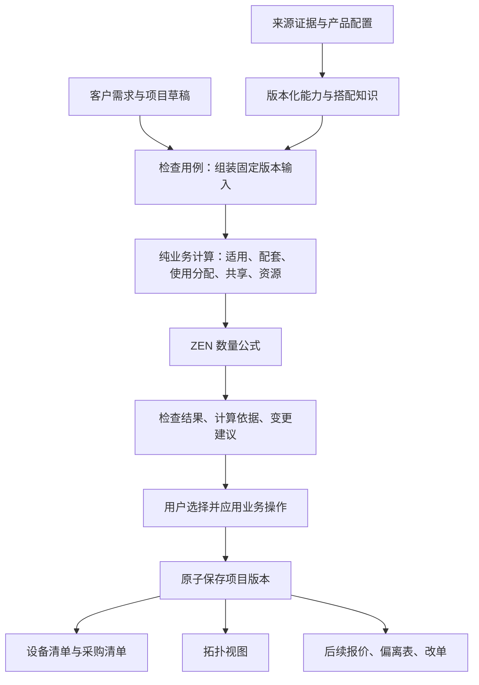

# 核心业务架构复核与演进建议（2026-09-27）

## 评审范围与结论

本次基于当前代码进行复核，并对五个语义场景做隔离函数调用。没有修改应用代码、业务资料或数据库。以下建议是待实施设计，不代表功能已经完成。本轮不讨论登录、权限等上线设施，优先解决知识维护和售前计算闭环。

保留 React / Ant Design、FastAPI 模块化单体、PostgreSQL、Python 判断、ZEN 数量计算、draw.io 图纸视图。当前最需要改的是业务语义、知识复用和输出可追溯性，不是增加技术栈。

可以形成艾索长期积累的能力，是有来源、有版本、能执行的产品搭配知识，以及基于它产生的选型、核算和变更解释。这里的“专有能力”指企业资料与业务经验的持续积累，不意味着底层架构在行业中独创。

## 当前已有的合理基础

- 原始来源、稳定产品身份、具体配置已经分开，来源可保留不同规格、价格和备注。
- 知识有草稿、确认、停用及修订；计算区分适用、配套和共享。
- 房间、系统实例、角色需求和实际部署设备分开；共享按设备标识处理。
- `device_usages.py` 已统一直接选型与配套关联，清单和检查可以复用。
- 项目有配置快照、知识快照、计算语义版本和预期版本校验；清单、图纸具有同一业务配置来源。
- 模型提取、语义召回与确定性兼容判断分开，核心核算不需要等待模型。

这些基础应继续复用，不另建第二套产品库或项目事实来源。

## 需要优先纠正的语义

### 1. 数量未知被默认成 1:1

`knowledge/schemas.py:84` 起默认使用设备范围、每单位计算、系数 1；前端 `KnowledgeRuleStep.tsx:24` 明示默认 1:1 并折叠数量编辑。隔离调用确认：带候选的配套记录省略数量依据，仍能以已确认状态通过 schema。

改进：将“数量待确认”与用户主动选择“每台一个”分开；界面可提供快捷选项，但不能把未填写解释成已知业务规则。确认适用关系和确认数量依据分别记录；仍允许保存不完整草稿。历史的 1 不自动清空，列出依据不足的记录供核对。

### 2. 现有检查通过不等于方案完整

`projects/readiness.py:33` 只检查房间、系统、角色列表是否非空；没有检查每个系统实例是否已经表达了必要需求。`accessory_stage` 将空建议视为没有待补配套。`output.py:4` 则由计算状态直接赋予 confirmed。

隔离例子中，一条兼容检查通过且无配套建议时可以输出 confirmed；额外增加一个完全没有角色的系统也不改变结论。这不能证明真实项目一定被误判，但证明当前完成度函数无法识别这种缺口。

改进：为系统版本维护必要角色和已选择功能；对其配套知识明确记录“已整理、有待确认项、明确不适用”。无规则不等于明确不需要。输出区分“已知检查通过”“资料覆盖完整”和“人工确认的项目版本”。缺资料可保存和出草稿，不强迫补虚构数据。

### 3. 可选配套与必需配套没有进入完成度语义

`readiness.py:65`、`:100` 未使用配套性质；有缺量的 optional 建议也使项目不能形成确认输出。

改进：必需需求核对缺量；推荐和可选项由售前明确选择是否纳入本方案，未选择只作建议。选中的可选项仍需检查兼容、数量和自身必需配套，不能全局忽略 optional 的冲突。

### 4. 条件分支与必须同时满足的约束混在一起

`knowledge/evaluator.py:56` 对命中的允许关系采用任何一条失败即冲突。Windows 与 Linux 两个替代分支若分别录成两条规则，Windows 项目会因 Linux 分支失败而冲突。

改进：明确区分规则启用条件、启用后的约束和可替代分支。同一字段的简单替代可使用现有集合条件；跨字段分支需要显式表达组关系。不能把所有规则一律改为 OR，也不能以最后修改覆盖矛盾。

## 与业务相匹配的核心模型

### 产品能力与可复用知识

当前系统类型、角色及共享角色组合仍以显示文本匹配（`projects/schemas.py:15`、`knowledge/evaluator.py:91`、`projects/device_usages.py:139`）。增加稳定的系统版本、角色和能力标识，名称仅用于显示；迁移应显式保留旧版本映射，不能按相似名称合并。

建议用“系统版本 + 环境分支”的知识包组织维护：

- 需要哪些角色和可选功能。
- 各角色要求哪些产品能力、软硬件环境和资源。
- 产品族共用条件、具体配置例外和来源依据。
- 配套需求的性质、候选范围、数量口径及完整程度。
- 哪些角色可以共享，以及容量或部署限制。

这里的知识包是已有知识的组织和发布单位，不是固定整套采购模板。继续自由选配；同一服务器通过不同角色条件分别成为多个产品线的候选。能力或系列标签用于缩小范围，不能单独证明兼容。

现有 selector 已支持系列、类别和具体配置排除，优先复用；新增配置可预览可能适用的共性知识，未确认适用边界时保留草稿，避免复制确认状态和依据。

### 项目中的需求、部署、供货分开

继续使用现有需求、部署设备、配套分配模型，补充实际售前需要的区分：

- 需求：客户需要什么功能、容量、环境，以及参数来源。
- 部署：哪些软件、授权和设备共同实现需求，设备服务哪些系统。
- 供货：设备由本次采购、客户已有或其他已确认方式提供；软件授权是否已有、能否用于本次部署另行核对。

目前 `Deployment` 没有供货来源，而 `output.py` 对每个实际设备直接输出数量。因此现有输出属于设备配置清单，不能直接当作净采购清单或正式报价。

一台共享服务器应在部署中出现一次、关联两个系统；如果客户已有该服务器，则仍要检查兼容和容量，但不应仅因出现在拓扑中就自动计入新增采购。

### 连接和安装事实承载音视频辅材

当前 draw.io 保存设备引用和外观，尚无业务级端口、连接和线路模型。未来音视频扩展应增加端口、协议、连接用途、实际路径长度和安装方式等事实；画布只是这些事实的视图。

由连接事实和确认规则计算线材、转换器及安装配件。不能从画布线段长度推算实际米数。数据不足时列出所缺信息；不同场景的余量和取整方式必须有依据。

定制产品也使用相同结构：明确尺寸、材料、安装条件、规格范围和数量依据，给出可行性与材料计算结果；制造价格需要单独的确认口径，不能由尺寸自动推定。

这两类扩展应在无纸化与会议预约流程稳定后各选一个明确场景验证，避免当前就建设通用工程建模平台。

## 计算和工程边界

建议在现有模块内形成以下链路，而不是新增服务：

### 具体代码优化

1. **检查与修改分开。** `checks.py:33` 调用 `prune_stale_allocations` 修改配置。将失效关联清理作为可追踪的业务操作，或由删除设备操作同步完成；检查本身返回建议。保证清理进入保存和撤销历史，避免页面只检查却改动业务事实。
2. **用例、存储、投影分开。** `ProjectConfigurations` 当前同时组装快照、计算、应用、保存和生成旧清单投影。按这些责任在现有 feature 内抽取，保留公共接口、事务和乐观并发约定。路由不应从旧 `rules.routes` 导入执行器，数量引擎依赖由统一组装位置注入。
3. **复用一次检查的索引。** `prepare()` 每次装配全量配置和来源，并逐设备验证快照；版本检查也逐对象查询。先记录候选查询、检查、保存的耗时和查询数，再按所需 ID 批量读取、建立一次计算上下文。先复用现有设备使用投影，不急于加跨请求缓存。
4. **列表与详情分开。** 配置列表先返回摘要；源文件原文和冲突详情按需取。JSON 保留为修订快照，稳定身份、常用查询和引用关系按需要增加结构列或投影，避免一轮重建全部表。
5. **版本输入边界明确。** 当前候选接口可冻结知识，却读取最新产品目录；已选设备保留配置快照。界面和接口要区分“按历史方案复核”与“按当前目录找替代”，不能让两者呈现为同一个历史结论。影响提示优先过滤到本项目实际使用的知识和配置，保留查看全部变更的能力。

## 可以持续积累的差异化能力

### 1. 一处维护，多场景复用

从产品或系统版本进入知识维护页，集中查看适用角色、必需配套、可选项、环境、共用条件和待确认项。批量选配置、填写一次依据、预览影响并发布一批修订，复用现有业务接口。减少逐条重复输入，不依赖 AI 猜测参数。

### 2. 每项数量都有业务解释

计算结果统一记录需求 ID、范围 ID、输入值及单位、配置修订、规则修订、公式、来源定位、已分配和缺量。能沿“这台服务器 → 服务两个系统 → 各系统资源 → 容量判断 → 采购数量”逐层解释；这是对现有 evidence/fingerprint 的补充，不另建一套计算结果。

### 3. 改单有影响预览

终端数量、产品型号、国产化环境或软件版本变化时，先显示受影响的角色、服务器、授权、配件和数量差异；保留旧项目版本，用户确认后应用。第一步做确定性的完整重算加差异比较，有性能证据后才做局部重算。

### 4. 同一项目版本形成不同业务产物

设备清单、采购清单、图纸都读取同一配置版本。后续报价补充价格采用依据、折扣和其他商务口径；偏离表补充客户要求原文与产品证据逐项对照；改单比较两个确认版本。这些产物共用事实与证据，但不能用同一份设备列表直接冒充已完成的报价或偏离表。

## 推荐实施顺序

1. **先修计算可信度：** 数量未知、可选项状态、环境分支、知识覆盖及确认语义；新增针对性回归，不静默重写旧项目。
2. **再减维护工作：** 稳定系统/角色标识、产品与版本工作台、共性知识复用、来源引用和批量发布预览。
3. **完成当前跨系统案例：** 无纸化与会议预约独立/共享服务器、软件授权独立核算、已有设备与新增采购分开；真实共用依据缺失时继续显示资料不足。
4. **补足变更与输出：** 统一计算解释、改单差异、确认版本；随后接报价和偏离表的专属数据。
5. **按真实场景扩展：** 一个音视频连接计算案例、一个定制尺寸案例，复用同一计算结果和证据约定。

验收不能只检查页面可操作：需要验证录入一次共性知识后的多配置复用、新增配置的待确认边界、未选择配件不入采购、已有设备不重复采购、替代环境不互相冲突、旧版本可重现、修改后差异可解释。

## 本次验证记录与限制

通过独立 Python 子进程调用现有纯函数和 schema，整批设置 60 秒硬超时，无数据库连接，无真实产品结论写入：

| 隔离输入 | 当前实际结果 | 说明 |
| --- | --- | --- |
| Windows/Linux 分别为两条允许条件，项目为 Windows | 一条 pass、一条 fail，整体 conflict | 条件替代语义需要显式建模 |
| 单角色已选、兼容通过、无配套建议 | confirmed=true | 无法区分“无规则”和“明确无需配套” |
| 上述输入另加一个没有角色的系统 | confirmed=true | 必要需求覆盖未校验 |
| optional 配套缺量为 1，尚未选择 | unknown，confirmed=false | 可选项与必需项混用完成度判断 |
| 已确认配套省略计算范围、方式、系数 | schema 接受，默认 device/per_unit/1 | 未填写数量依据仍获得默认公式 |

这五项是函数/schema 边界复现，不是完整 HTTP 或浏览器验收，也不说明这些情况已发生在业务库。未执行全套后端回归、前端构建或浏览器测试；本次没有应用代码修改。性能建议来自调用路径检查，尚无负载测试数据，不能宣称已经存在某个延迟幅度。
