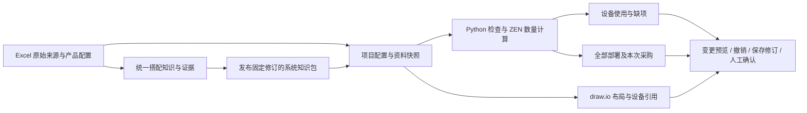

# 核心业务使用及架构

本轮主流程：**维护产品事实 → 复用搭配知识 → 按系统和角色选型 → 检查配套 → 分配已有与采购 → 预览改单 → 保存并确认具体版本**。不需要配置模型才能使用这条流程。

## 知识怎么维护

1. 在“搭配知识 → 按产品维护”选择一个或多个具体配置。右侧查看原始资料，直接维护适用、配套和共用关系；同型号跨版本仍独立选择。
2. 多个产品共用一条关系时，用同一选择范围维护，不复制成多条。系列关系可明确排除配置，并注明依据覆盖整个系列，还是仅覆盖已经核对的配置。
3. 配套可先记录“需要服务器”并确认这部分事实。缺型号、范围、公式或数量依据就保留未知；“每台一个”等快捷项只在明确点击时填写，不再自动填 1。
4. 环境条件区分“什么时候启用”和“启用以后必须符合什么”。Windows/Linux 可建显式替代组；数量按设备/系统/房间/项目稳定 ID 分组。
5. “按系统维护”建立系统版本与角色、可选功能和能力标识，随后选取已有知识及具体修订形成知识包。资料覆盖结论需单独填写：未核对、有缺口、已列全配套或有依据的无需配套。
6. 发布包固定成员修订；更新成员后，需要明确采用最新修订再发布。项目也必须明确选择该知识包。批量操作先预览再应用，版本冲突会整批报错。

旧关系可以从系统视图预览身份映射，确认映射后生成草稿系统定义。不要把“已完成身份映射”当成“已确认兼容”。旧平面表和历史入口继续保留。

## 售前怎么做项目

1. 新建项目，进入需求选配，建立房间/系统/角色；在“系统版本与角色”关联已经维护的定义及知识包。
2. 选择角色，在持续打开的候选区选配置或关联已有设备。新增时填写清单类型及供货来源。客户已有硬件不自动抵扣软件和授权。
3. 查看配套卡片的需要量、已分配量、缺量、输入与知识依据。候选可替代，不会全部进入清单。可选/推荐先切换“本次选用”，再按确定型号补入或明确关联已有设备。
4. “已有与采购”支持拆分，比如部署 10 台，客户已有 4 台、本次采购 6 台；未分配部分显示供货待确认，多分配显示冲突。
5. “设备与采购清单”区分全部部署和本次采购。拓扑引用全部部署，已有共享服务器继续显示；普通图形引用不会增加采购，复制为新设备会要求重新选择供货。
6. 修改数量、配置或供货后，使用“预览本次改单”对照旧版本及采购差异。失效配套关系另有清理预览，检查本身不擅自删除关系或采购。
7. 应用结果进入同一撤销历史；保存带预期版本。存在未知可保存草稿。资料范围与全部已知检查都满足后，才能对已保存修订点击“确认已保存版本”，填写人员与依据。

保存、检查、人工确认不是同一件事。新版草稿不会改变旧确认版；“按最新资料重新检查”先预览产品、知识包或计算语义差异，应用到草稿后仍需保存。

## 数据如何复用

项目配置是业务事实来源，清单、采购、图纸及改单差异都是投影。外层服务负责读写与事务，计算层只处理固定输入。系统不通过名称推断共用、不通过图形位置推算线长、不通过 LLM 猜采购量。

产品适配、数量、资料覆盖、资源容量和共用依据分别有结论。同一服务器可服务不同系统，但必须按具体配置、环境、容量和共享证据核对。只有事实足够才会通过；当前真实资料没有确认跨系统共享，仍需业务维护者补充依据。

实施、性能与验收详情见 [实施记录](core-business-evolution-progress.md)。
