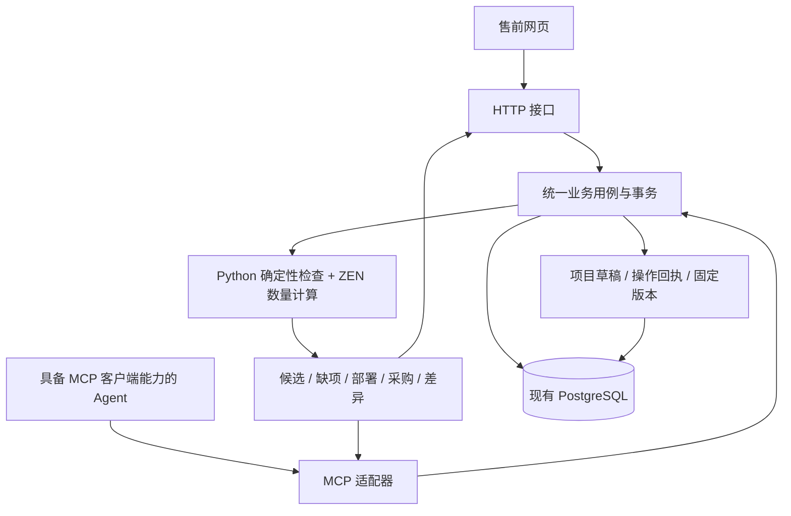

# MCP 业务能力接入计划

日期：2026-09-27。状态：待实施。本次只整理计划，不修改应用代码或业务数据。

范围已按用户后续说明收窄：MCP 主要给其他 Agent 制作清单。首轮工具与实施边界以 [清单 MCP 精简计划](mcp-list-tools-plan-2026-09-27.md) 为准。本文件保留为架构参考，完整网页协作草稿、知识维护工具及内网部署不再作为清单 MCP 首轮前置。

## 1. 目标与本轮范围

让其他 Agent 能调用艾索售前平台完成：查产品及依据、理解系统角色、选择具体配置、检查配套、分配已有与采购、预览改单并保存项目草稿版本。人和 Agent 使用同一套产品、知识、计算和版本机制。

首批接入位置尚待用户选择，本计划暂按本机调用优先设计；后续内网接入保留同一业务接口。该假设只影响传输与部署，不改变业务模型。

继续使用 Python、FastAPI、PostgreSQL、ZEN 和现有 React/Ant Design/draw.io。MCP 是调用入口，不是新的规则引擎，也不内置另一个 Agent。此次不接 LangChain、LangGraph、OR-Tools，不增加 Redis、微服务或完整登录权限系统。

首轮贯穿“红盾 Windows 无纸化 + 会议预约”，对比两台独立服务器、一台共用服务器、客户已有服务器。真实依据不足仍返回资料不足；软件授权独立计量。

## 2. 代码核对后的起点

| 已有能力 | 可复用位置 | MCP 接入需要补充 |
| --- | --- | --- |
| 版本 3 配套、容量、共享和采购核算 | `configuration/projects/calculation/` | 结构化结果摘要与按 ID 获取解释 |
| 项目保存及预期修订检查 | `projects/repository.py` | 服务端草稿和提交幂等 |
| 改单预览、配套应用、确认修订 | `projects/services/` | 使用草稿 ID 调用，统一操作记录 |
| 固定知识、产品、定义及包修订 | 项目快照服务 | 所有候选/检查显式沿用草稿版本上下文 |
| 知识批量预览和幂等应用 | `knowledge/batch_service.py` | 抽出可复用机制，不把知识接口当通用操作网关 |
| 候选查询和知识校验 | 目前部分仍在 `routes.py` | 将编排移至所属功能服务，HTTP 与 MCP 共用 |
| 设备增删、供货、复制及图纸同步 | 部分编排在前端 | 后端提供相同业务操作，避免 Agent 重写规则 |

当前 MCP 尚未接入。网页草稿主要在浏览器内存中；Agent 无法读取用户尚未保存的修改。现有项目接口需要传整份配置，包含完整知识及产品快照；上一轮试点检查响应约 420KB，不适合每次都交给模型处理。

现有 `change-apply` 返回计算后的配置，不直接保存项目，不能把它包装成名为“保存项目”的 MCP 工具。外层检查还可能登记不可变快照，不能将所有检查入口笼统声明为数据库只读。

## 3. 目标架构



两个入口调用同一应用服务，MCP 不调用前端，也不从 FastAPI 路由函数导入业务。领域计算不依赖 MCP、HTTP、数据库会话或模型客户端。

计划目录：

```text
backend/src/presales/
  configuration/
    catalog/services/                 # 查询与原资料解释
    knowledge/                        # 现有知识维护服务、证据与修订
    projects/
      services/                       # 草稿、命令、检查、预览、提交
      schemas/ 或现有 schemas.py      # 明确类型的业务命令及结果
      repositories/                   # 草稿、回执、检查记录持久化
      calculation/                    # 原版本 3 纯计算
      projections/                    # 同一结果的网页 / Agent 摘要
  mcp/
    server.py                         # 注册工具和资源，生命周期装配
    tools/                            # 产品、项目、检查、变更
    resources.py                      # 可追溯详情读取
    errors.py                         # 业务错误到 MCP 结果映射
    stdio.py                          # 本机启动入口
```

按责任边界逐项抽取，保留现有公共 HTTP 接口。不为目录整齐而重写所有模块；新工具复用原业务校验，避免产生“网页能保存、Agent 不能保存”的两套口径。

## 4. 先建立服务端草稿

### 草稿与正式修订

增加 `ProjectDraft`，保存：

- `draft_id`、项目 ID（新项目提交前可为空）、项目名称。
- `base_project_revision`、`draft_revision`、草稿状态。
- 当前完整配置、知识/系统定义快照引用、计算语义版本。
- 创建入口、调用来源描述、操作依据及创建/更新时间。

草稿直接存现有 `Configuration` 模型，不复制一套 Agent 专用产品库。业务编辑由命令产生新的草稿修订；原项目已保存版本不受影响。

新项目可从空草稿开始，已有项目从明确保存修订建立草稿。网页增加“打开协作草稿/继续编辑”入口；现有网页本地未保存修改必须显式保存为协作草稿后，Agent 才能看到。

### 多 Agent 与网页协作

- 默认各自建立草稿，比较独立部署和共享部署等方案；不自动改同一个全局“当前项目”。
- 需要共同编辑时明确传同一个 `draft_id`。每次修改都携带 `expected_draft_revision`，旧请求返回冲突，不覆盖新修改。
- 项目已有修订被别人更新时，提交返回基线冲突。首版展示差异并由调用方重新选择基线；不做自动三方合并。
- 网页打开协作草稿时复用相同命令接口。撤销是恢复指定草稿修订的一次新操作，同样校验版本，不暗中撤销其他 Agent 后续修改。
- MCP 连接、会话或 JSON-RPC 请求 ID 均不充当业务草稿 ID。断开连接不丢草稿，不要求同一个 Agent 进程一直运行。

## 5. 将前端编辑动作变成业务命令

新增有类型的命令，不要求 Agent 拼完整 `Configuration` 或 draw.io XML：

| 命令类别 | 首轮支持 |
| --- | --- |
| 需求 | 建立/更新房间、系统、角色需求、环境和已知规模 |
| 选型 | 为角色选择明确配置和来源；关联项目现有设备 |
| 部署 | 改数量、替换配置、复制为新设备、删除设备及关联 |
| 选配 | 选用/取消可选需求；按检查结果选择配套候选或关联已有设备 |
| 供货 | 设置采购、客户已有、待确认分配及依据 |
| 版本 | 明确选择知识包；按最新资料/新算法预览升级 |
| 图纸 | 添加/移除设备视图引用；布局仍由现有图纸编辑器维护 |

业务属性由后端校验并同步图纸引用。复制图形只新增引用；复制设备生成新 ID，并显式填写供货来源。删除设备同步移除使用、配套、供货和图纸关联。

批量命令按顺序在一个草稿修订中原子应用；支持批内临时引用，服务端返回临时引用到真实 ID 的映射。任何命令失败整批回滚。普通字段修改后标记原检查过期；依赖缺量的配套应用必须验证指定检查指纹。

调用方只能提交选择、输入条件和依据，不能提交“已经兼容”“已审核共享”“最终采购量”等计算结论。未知仍是合法业务状态，允许形成草稿。

## 6. MCP 首轮工具与资料读取

不把全部 REST 路由自动转成工具。按 Agent 实际任务提供以下工具；名称在实现时冻结为契约。

| 工具 | 主要输入与输出 | 作用 |
| --- | --- | --- |
| `catalog_search` | 关键词/系统/属性 → 分页配置摘要、稳定 ID、来源提示 | 查产品，不按型号静默合并 |
| `catalog_get` | 配置 ID + 修订 → 属性、出处、原始价格字段 | 查看具体配置事实 |
| `systems_list` | 过滤条件 → 系统、角色、已发布包及修订 | 发现有效业务身份 |
| `knowledge_search` | 配置/系统/关系类型 → 已确认及草稿关系、缺口 | 理解依据与未知 |
| `evidence_get` | 来源 ID/知识修订/检查项 → 原文及定位 | 获取证据，兼容只支持 Tools 的客户端 |
| `projects_list` / `project_get` | 条件或项目及修订 → 项目摘要/选定视图 | 获取明确保存版本 |
| `project_draft_open` | 已有项目修订或新项目名称 → 草稿 ID/修订 | 建立可恢复工作副本 |
| `project_candidates` | 草稿 ID/修订 + 角色 ID → 候选及检查依据 | 沿用本方案版本，明确区分查当前目录 |
| `project_draft_update` | 草稿 ID/修订 + 命令列表 → 新修订及变化 | 原子编辑草稿 |
| `project_check` | 草稿 ID/修订 → 检查记录、缺项、采购摘要 | 保存本次计算记录，不改草稿配置 |
| `project_preview_changes` | 草稿 ID/修订 + 目标基线/升级意图 → 预览 ID及差异 | 改单与资料升级预览 |
| `project_save_draft` | 草稿/项目预期修订 + 预览 ID + 幂等键 → 项目新修订 | 保存业务草稿版，不自动人工确认 |
| `operation_get` | 操作 ID 或幂等键 → 已提交结果/未找到/失败原因 | 网络断开后确认真实执行结果 |

`project_draft_update` 的具体业务命令用带 `type` 区分的输入模型；客户端若不支持此类 schema，则拆成明确小工具，复用相同服务，不退回任意 JSON 或自然语言指令执行器。

首轮 Agent 可主动查资料、选品、检查、修改和保存草稿，不要求每个普通操作人工点一次确认。正式项目确认与知识发布沿用现在的业务动作，首轮保留网页入口。若以后授权 Agent 做最终业务确认，单独扩展能力与操作者记录，不能用 Agent 自填的人名冒充人工确认。

下一批按实际使用需要增加“知识草稿提议”，仍调用同一知识服务，保留原文依据、批量预览及维护者确认，不建立第二套 Agent 规则库。

### 输出契约

使用 Pydantic 定义输入和输出，通过 SDK 发布 JSON Schema。关键结果包含：

- 业务 schema 版本、项目/草稿及修订、采用的产品/知识包版本。
- `pass / conflict / unknown`、已知检查、资料覆盖和能否确认。
- 缺项、数量及单位、采购/已有分配、规则及证据引用。
- 检查指纹、预览指纹、操作 ID 和网页定位链接。

数量使用十进制字符串；空值不解释为 0。返回结构化结果及一致的文本形式，不只返回一段模型需要二次猜测的中文总结。

列表分页，常规调用只返回所请求的视图与摘要；详细说明、原资料和图纸按 ID 读取。分页必须提供游标和未取完提示，不能默默截断。正常检查不返回完整知识库、全部产品参数或整幅 XML。

补充稳定资源 URI，例如 `presales://projects/{id}/revisions/{revision}/procurement`、`presales://checks/{check_id}/evidence/{item_id}`。Resources 是资料入口，不作为客户端必须支持的前提；同样内容可经读取工具取得。

## 7. 预览、提交与重试语义

预览固定基线项目修订、草稿修订、计算语义、所用资料版本和候选差异。升级资料的预览结果也要固定目标修订，应用时不能偷偷采用预览之后的新资料。

所有写操作携带调用方生成并可重用的 `idempotency_key`。数据库记录工具/命令类型、请求摘要和结果；相同键相同请求返回原结果，相同键不同内容明确冲突。

正式提交在同一事务内完成：

1. 校验项目基线及草稿修订。
2. 校验预览确实对应当前输入与固定资料版本。
3. 调用原有项目保存与投影服务。
4. 写入项目修订、草稿提交状态及操作回执。

项目未满足真实搭配条件时仍可保存草稿，但结果显式保留 `unknown/conflict`。接口没有“强行通过”开关。

请求超时或连接取消不等于业务回滚。提交已落库则用同一个幂等键返回原结果；事务未提交则回滚。`operation_get` 查询后再决定是否重试，不因响应丢失新增第二台设备或多保存一个项目版本。

保存需与原项目锁保持一致。重试回执优先于过期修订检查，保证已成功但响应丢失的原请求可以取回成功结果。配套分配原有防重复机制继续执行，不能只靠客户端记住是否已补料。

操作记录保存调用入口、调用来源描述、业务依据、目标及前后修订、请求摘要、结果摘要和关联 ID，不记录密钥或完整模型对话。本机客户端自报名称只是追溯信息，不是认证身份。

## 8. 技术与运行方式

使用官方 Python MCP SDK。调研时主版本为 2.x，官方示例入口为 `mcp.server.MCPServer`；实施时锁定经验证的稳定版本，不照搬旧版 `mcp.server.fastmcp` 示例，也不同时引入另一套同名框架。

本机优先 stdio：Agent 客户端启动一个 Python MCP 进程，使用相同应用服务和数据库；日志写 stderr，stdout 专用于协议。无需新增 Node 业务服务，Python 进程不复制业务逻辑。

内网接入使用 Streamable HTTP，可挂在现有 FastAPI 应用的 `/mcp`，共享依赖和生命周期。先完成请求级状态、会话/资源清理及 SDK 兼容验收，不另建独立微服务。MCP 的连接状态不保存业务上下文。

当前不实施账号体系。本机绑定保持本机；真正开放内网时，再接可识别调用方的认证及项目访问范围，不能把无认证的本机接口直接当企业共享服务。该部署步骤不阻碍本机业务验收。

至少用一个真实目标 Agent 客户端验收协议版本、工具发现、结构化结果和长响应。具备兼容 MCP 客户端能力是接入条件；有 Agent SDK 不代表天然已经支持 MCP。协议协商交给官方 SDK，不手写 JSON-RPC。

短业务操作同步执行；既有资料提取/索引任务仍使用原数据库任务机制，不把 MCP 会话、SSE 或心跳当工作队列。该轮不新增模型调用。

## 9. 按交付顺序实施

| 阶段 | 交付物 | 完成条件 |
| --- | --- | --- |
| A：业务接口整理 | 候选/知识校验服务、业务命令 DTO、Agent 摘要、领域错误码 | HTTP 结果保持兼容，同输入同业务结果 |
| B：协作草稿 | 草稿及修订、预览、回执、网页草稿入口 | 多调用方互不覆盖，恢复及撤销可追溯 |
| C：MCP 本机闭环 | 上述工具、资源、stdio 入口、连接配置样例 | 真实客户端从查产品到保存草稿完成一次流程 |
| D：贯穿验收与内网适配 | 两组隔离案例、协议兼容记录、HTTP 装配 | 软件流程通过；内网仅在确认部署位置及访问方案后启用 |

草稿、操作回执和检查记录采用显式增量迁移；高频查询字段用独立列及索引，配置继续保留 JSON。保留所有既有产品/来源/知识/项目 ID，旧项目不用自动迁移成协作草稿。

原 HTTP 接口继续工作。新网页协作模式和 MCP 优先使用新命令用例；旧接口逐步经适配调用同一服务，避免一次性破坏已有前端。

## 10. 验收用例

1. 同型号不同配置通过 ID、来源、修订明确区分，Agent 不凭型号合并。
2. MCP 与网页对同一固定配置得到相同兼容、配套、部署及采购结果。
3. 独立两台、共享一台、已有一台计量正确，软件/授权独立。
4. 缺兼容/共享/数量依据返回业务未知，可存草稿，不返回伪成功或默认数量。
5. 两个 Agent 修改同一个草稿旧修订返回明确冲突；不同草稿互不影响。
6. 相同写入请求串行/并行重试不重复建项目、设备、配套或知识；变更内容复用同键返回错误。
7. 事务提交后丢失响应，可通过操作回执恢复；进程中断、服务重启后仍能读取草稿。
8. 预览后发生设备、供货、草稿或项目基线变化时无法错误提交；资料升级采用预览中的明确版本。
9. 网页查看 Agent 草稿、修改、撤销、提交与图纸一致；旧确认版本不改变。
10. 空分页、游标续读、同版本明细读取和不可追溯出处明确处理；既有 420KB 项目响应不直接倾倒给模型。
11. 工具执行失败使用明确错误码及 MCP 错误结果；合法业务 `unknown` 与网络/数据库失败分开。
12. 工具行为注解按实际副作用标注：持久化草稿、计算记录或预览记录的工具不能冒充严格只读；注解不是授权校验。
13. stdio stdout 无日志污染；HTTP/stdio 与目标客户端的兼容分别测试，未执行的不标通过。

后端每项和每批测试继续使用 60 秒硬超时；新增 MCP 协议层、DTO 契约、PostgreSQL 并发/幂等测试。前端类型检查、生产构建及浏览器验证协作草稿。真实资料副本与合成确认知识分别隔离，缺真实客户和共享依据的业务项仍标未验收。

## 11. 官方资料核对

- [Python SDK](https://github.com/modelcontextprotocol/python-sdk)：官方 SDK 当前主版本、客户端与服务器入口。
- [传输规范](https://modelcontextprotocol.io/specification/2026-07-28/basic/transports)：stdio、Streamable HTTP 与协议兼容。
- [Tools](https://modelcontextprotocol.io/specification/2026-07-28/server/tools)：输入/输出 schema、结构化内容、工具执行错误和行为注解。
- [Resources](https://modelcontextprotocol.io/specification/2026-07-28/server/resources)：资料读取与资源引用。

以上是协议依据；草稿模型、工具划分、事务及人工确认边界是结合本系统提出的设计，不是 MCP 协议自动提供的业务功能。
