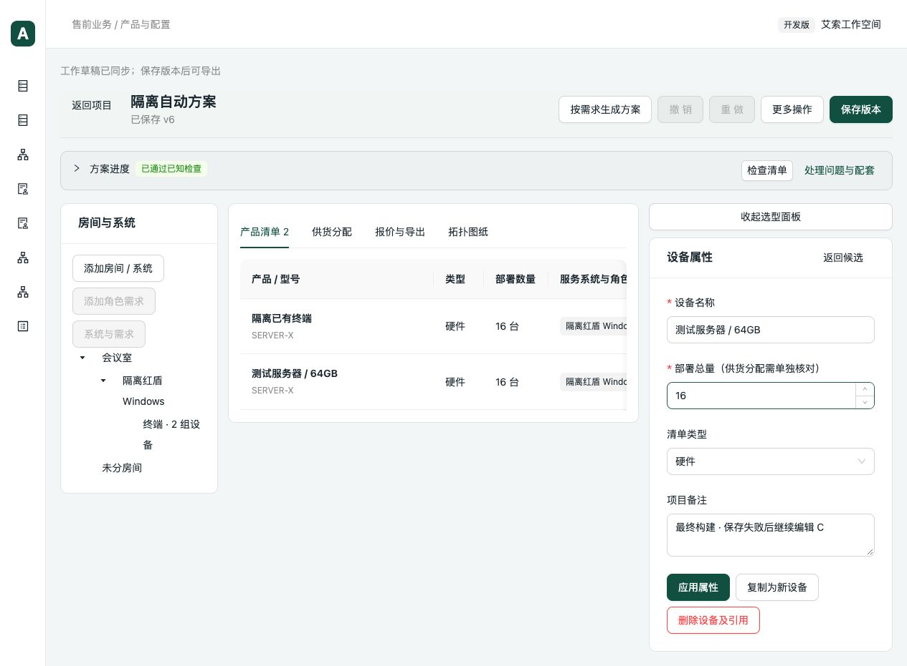

# 核心 Review 修复验收（2026-09-29）

修复上一轮 `../2026-09-29-core/README.md` 中的五项问题。该报告与原复现保留作为修复前证据。

## 修复结果

| 问题 | 修复与验证 |
| --- | --- |
| 保存结果读取失败后，重试回放旧保存并覆盖后续编辑 | 提取保存事务，分别保留检查、提交与读取阶段；网络结果不确定时沿用请求 ID，后续草稿修订使用新保存事务。409/422 明确报告并重新取得草稿修订，后续修改仍可同步。校验读到的项目修订与保存回执一致。 |
| 旧产品编辑入口修改参数绕过搭配复核 | 所有配置保存进入同一参数变更处理；比较修改前后适用范围，记录关系、知识包和项目影响。名称、展示文字和属性排序不触发技术复核；技术修改不能通过提交空复核列表跳过复核。 |
| 包外新增规则改变已发布知识包的选型 | 运行时按采用的知识包过滤成员及固定修订；未采用包的系统保留历史快照规则。配套、禁用、共享、参数复核和循环检查都使用同样的成员范围。跨系统公共规则须显式发布到消费该规则的包。原始快照不增加内部计算字段，不改写已保存历史。 |
| 共享分支擅自使用未指定的客户设备 | 自动共享只使用生成的硬件实例；客户已有设备仍需明确允许复用，包括原本生成、后来改成客户已有的实例。 |
| 同型号已有服务器替代方案漏掉第二台设备 | 按实际设备 ID 展开复用选择及采购余量；选项按需计算，不先枚举全部组合；已有数量抵扣和人工锁定保持原语义。 |

自查同时覆盖：两个系统分别采用包内旧修订和包外新修订时，新复核不能替旧包解除待确认；不相交知识包的配套关系不能构成虚假循环；同一生成需求的旧设备不再作为自己的新增余量抵扣。

## 自动验证

- 后端全套分 17 批运行，389 项通过；最终补充回归 20 项通过（包含最后新增的 2 项，其余为复跑）。去重覆盖最终收集的 **391 项测试**，无跳过。
- 每项 `pytest --timeout=60`，每批由 `subprocess.run(timeout=60)` 硬限制；最长一批 58.03 秒。
- PostgreSQL 并发测试使用独立 schema；真实产品工作簿测试只读取文件，并在隔离 schema 整理。其余使用隔离 SQLite。
- 前端 **71 项测试通过**，覆盖保存前后响应丢失、结果读取失败、后续编辑、重复提交及明确冲突。
- TypeScript 检查与 Vite 生产构建通过；保留原有 Univer 大分包提示，本轮未做包体减重。
- 修改的 Python 文件 Ruff 检查及 Git 空白检查通过。
- 现有旧规则、报价、MCP 协议、价格、并发保存及真实无纸化工作簿回归均包含在上述测试中。

部分旧测试依赖“包外规则自动生效”这一缺陷，已调整测试资料维护步骤：先将测试关系显式发布到相关包，再进行预期通过的检查；另保留包外共享关系仍显示资料不足的断言。

## 真实浏览器验证

生产构建使用临时端口 5178 / 8018，数据库为 `/tmp/presales-core-fix-browser.sqlite`，从之前的隔离测试项目复制，不接业务数据库。

通过浏览器 CDP 拦截正式保存后的项目 GET 请求并注入失败：

1. 服务端保存成功，页面收到读取错误 `Failed to fetch`，没有显示保存成功。
2. 在设备属性中继续修改项目备注，同步工作草稿。
3. 再次保存，产生新项目版本。
4. 刷新重开，页面显示已保存 v6，保留“最终构建 · 保存失败后继续编辑 C”。
5. API 读取验证新版本备注、两组设备数量均保持正确，结果见 `browser-result.json`。

临时网络拦截已解除，测试页面已关闭。截图为实际浏览器页面，未改动页面内容制作结果。

## 代码复核与边界

完成修复差异自查、固定版本与副作用路径检查，并用上述独立复现回归确认五项缺陷关闭。没有创建新的业务知识、共享依据或客户方案。本轮软件修复不等同于真实客户方案认证；桌面 Excel / WPS 重算未纳入本轮。

本次提交不包含工作区已有的 WPS 插件、后端入口及脚本改动。
