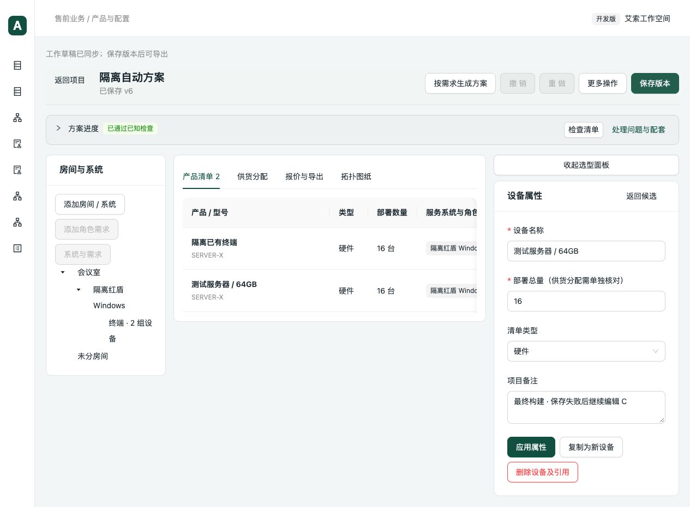

# 二次复审问题修复与验证（2026-09-29）

基线：`ec63973`。修复上轮复审确认的三项缺陷，未修改业务数据库或真实搭配资料。

## 修复及差异复核

1. **保存冲突后接受了其他编辑者的草稿（P1）**
   保存事务只接受自身检查／保存回执明确确认的草稿修订和项目基线。检查失败、保存失败或保存成功后的读取遇到其他编辑者修改时，不推进本地同步基线。保留现有并发错误，立即重试也不会保存远端其他编辑者的配置；用户须重新读取并核对草稿。422 校验失败仍可以使用自己的已确认检查修订继续编辑、重试；不确定响应继续复用原幂等键。

2. **无参数变化的配置修正清除待复核（P1）**
   统一产品保存入口保留原有待复核记录。省略字段、空数组或旧复核元数据都不能覆盖服务端已有记录。新增元数据可以补充；相同记录以服务端现有修订为准。真正完成知识修订与适用配置复核后，仍通过原有知识判断解除待确认。

3. **混用规则修订产生重复配套需求 ID（P2）**
   同一规则有多个有效修订时，按规则修订区分需求标识；已确认数量和数量待确认两条路径使用同一标识服务。旧项目无歧义的需求保留原 ID；已生成的新标识被配套分配、已含内容、选用记录或来源引用后，即使移除另一系统仍保持稳定。
   对已存在的歧义旧分配，不猜测其所属修订，不双重抵扣，不删除历史记录；现有检查明确提示重新关联。未改写历史项目、产品或知识快照，也未增加数据库字段。

复核覆盖保存回执、异步读取、再次保存、需求身份、配套抵扣、所有者传播和使用投影。`accessory_demands.py` 原有多参数长函数承担旧计算兼容，本次仅增加可选需求 ID，未为机械行数拆分旧逻辑；新身份逻辑集中在现有 calculation 模块内。

## 自动验证

- 隔离工作目录 `/tmp/presales-rereview-fixes`：Git 基线加本次 7 个修复／测试文件，不包含工作区的 WPS 改动。
- 后端相关回归 **122 项通过**，分 6 批。每项 `--timeout=60`，每批 `subprocess.run(timeout=60)`；涵盖产品与价格更新、知识包范围、配套、已含内容、共享、方案生成／改单、网页草稿及快照。
- 新增后端 11 项，覆盖项目／房间范围的两个规则修订分别补齐、重复应用、移除系统、未知数量、历史歧义分配、旧标识兼容、待复核保留及真实复核后解除。
- 前端 **75 项通过**，新增 4 项使用真实 hook 与保存事务源码，注入隔离网络依赖，验证检查冲突、保存冲突、422 重试及成功保存后的并发读取。
- TypeScript 检查和 Vite 生产构建通过。保留现有 Univer 大分包提示，本轮未改变插件或包体。
- 修改的 Python 文件 Ruff 检查及 Git 空白检查通过。

本轮不是全仓测试重跑；范围和输出见同目录日志。初次新增测试因复用辅助函数时重复传入 action 失败，已修正测试调用并完成最终全部相关回归。

## 浏览器验收

生产构建在临时 `5179 / 8019` 端口运行，数据库为上轮隔离样例的副本 `/tmp/presales-rereview-fixes-browser.sqlite`。

1. 打开项目 v6 对应的独立网页草稿修订 1，设备备注仍为原内容。
2. 通过同一业务 API 从另一客户端修改备注为“隔离验证：其他编辑者 B”，工作草稿成为修订 2。
3. 在浏览器连续两次点击“保存版本”，CDP 均观察到真实 `list_check` 409；没有 `list_save` 成功请求。
4. 页面继续保留原设备备注和“已保存 v6”；API 再次确认项目仍为 v6，未生成新版本，远端工作草稿仍保留另一编辑者的修改。
5. 关闭临时页面并解除网络监听，测试服务随本轮收尾停止。

浏览器只观察网络和操作真实页面，未伪造响应或修改页面内容。网络记录和业务状态分别见 `browser-network.json`、`browser-result.json`。

未进行真实客户方案认证或桌面 Excel/WPS 显示重算；这三项修复也不补充任何缺失的真实兼容、数量、容量或共享依据。
