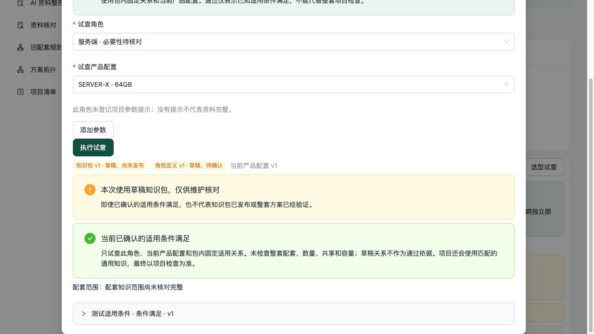
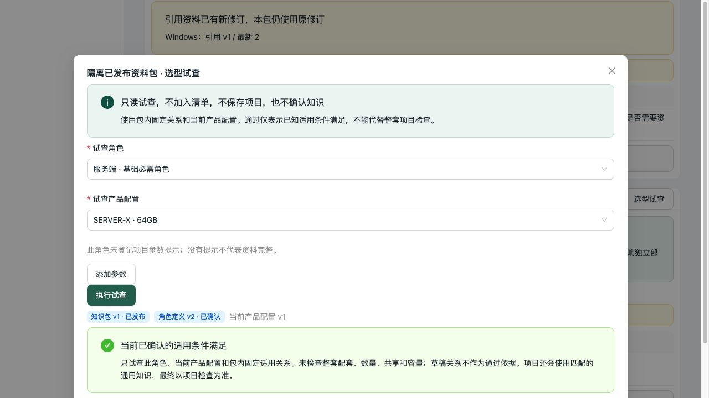
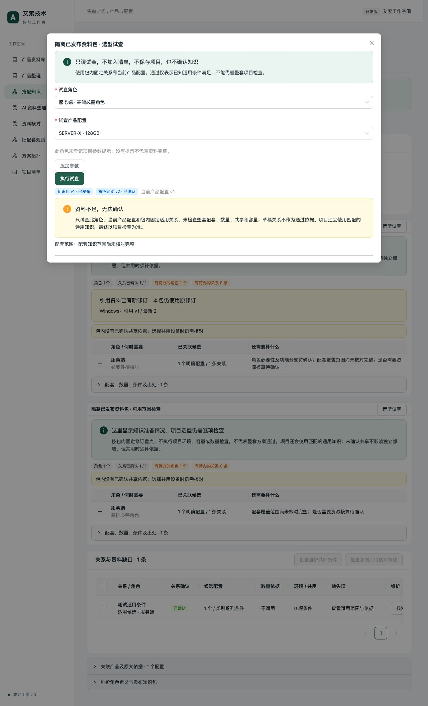

# 知识包试查状态：DF-001 收口

## 改动

试查结果直接展示响应中固定的知识包修订与发布状态、角色定义修订与确认状态，以及当前产品配置修订。草稿知识包附维护用途说明；单项成功改为“当前已确认的适用条件满足”，保留整套配套、数量、共享和容量未检查的说明及配套覆盖缺口。

本次只调整前端展示，沿用现有试查接口和判定语义。没有新增依赖、接口或业务知识。

## 验证

- `npm run build`：TypeScript 检查及生产构建通过，命令使用 60 秒进程超时。构建仍有既存的报价工作表大包提示，完整输出见 `frontend-build.txt`。
- `pytest tests/configuration/test_package_trials.py --timeout=60 -q`：13 项通过，4.87 秒；整批另设 60 秒进程硬超时。
- 浏览器实际操作隔离服务（前端 5184，后端 8024），使用独立 SQLite 测试库，没有改动真实产品或知识库。
- 草稿包固定角色定义 v1；当前定义已经修订为已确认的 v2，试查仍显示“角色定义 v1 · 草稿，待确认”，不会借用当前确认状态。已确认适用关系可满足条件，但草稿提示和配套资料缺口同时可见。
- 已发布包固定角色定义 v2，显示“已发布／已确认”，不显示草稿提示，仍保留配套资料不足说明。
- 切换为没有适用依据的另一配置时，旧结果先清除；再次试查显示“资料不足，无法确认”。

## 代码复核

本次为实现者自审：核对了后端 `configuration/definitions/trials.py` 的真实响应、前端联合类型及试查状态重置逻辑。状态取自本次响应，而非当前最新定义；确认与发布状态不影响原始 pass/conflict/unknown 判定。未发现本次变更新增的阻断问题。本记录不替代上一轮独立评审，也不宣称全量回归或真实业务搭配已经认证。

对应上一轮独立评审的 DF-001 已在本次实现并完成上述验证；上一轮评审报告保留原样。

## 截图

