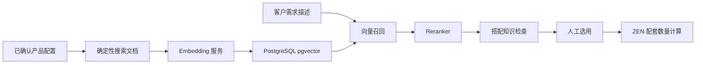

# 产品智能召回与候选排序

日期：2026-09-25

## 定位

智能检索只解决“从大量产品配置中找出可能相关的候选，并调整展示顺序”。它不确认兼容性，不计算辅材和授权数量，也不直接修改项目清单。

项目候选现在有三种模式：

- **已知候选**：沿用系统、角色和知识版本筛选。
- **智能查找**：Embedding 从已建立索引的配置中召回，Reranker 排序，然后继续执行现有搭配知识检查。
- **全部产品**：人工浏览全部配置。

最终顺序始终先按业务状态分组：已知通过、资料不足、明确冲突。模型高分不能把冲突变成通过，也不能越过已知通过的配置。

## 数据流



索引文档包含型号、产品名称、类别、品牌、配置、系列、功能、接口、适用系统、结构化属性以及来源参数和备注。价格不写入向量文本。

## 数据和版本

新增两张表：

- `configuration_search_documents`：保存配置版本、文档摘要、模型、1024 维向量和失败信息。
- `configuration_search_index_jobs`：保存后台索引任务、进度和错误。

配置或来源内容变化时，状态接口会根据内容摘要显示“需要更新”。保存产品不会直接调用模型。维护者在“产品整理 → 智能索引”中手动创建任务，再由后台进程分批执行。

模型地址、模型名和密钥保存到 `data/private/search.json`。密钥不写入数据库、代码或浏览器持久存储，设置接口不回显密钥。

## 模型接口

Embedding 使用 OpenAI 风格请求：

```json
{
  "model": "Qwen3-Embedding-0.6B",
  "input": ["产品检索文本"]
}
```

Reranker 使用常见的 `/rerank` 请求：

```json
{
  "model": "Qwen3-Reranker-0.6B",
  "query": "系统、角色和客户需求",
  "documents": ["候选产品文本"],
  "top_n": 20
}
```

服务必须返回全部输入的向量或排序分数。维度错误、缺少候选分数、超时和 HTTP 错误都会明确失败，不会换成型号字符串排序伪装成智能结果。

## 运行

数据库镜像已改为 `pgvector/pgvector:pg17`。升级现有环境：

```sh
docker compose pull database
docker compose up -d --force-recreate database
.venv/bin/pip install -e './backend[dev]'
.venv/bin/python scripts/migrate_configuration.py
```

启动索引工作进程：

```sh
.venv/bin/python -m presales.configuration.search.worker
```

配置真实模型服务前，页面会显示 163 个已确认配置尚未建立索引，“建立或更新索引”按钮保持不可用。普通产品维护、已知候选、全部产品、搭配检查和项目计算不依赖该模型服务。

## 接口

- `GET /api/configuration/search/settings`
- `PUT /api/configuration/search/settings`
- `POST /api/configuration/search/test`
- `GET /api/configuration/search/status`
- `GET /api/configuration/search/jobs`
- `POST /api/configuration/search/jobs`
- `POST /api/configuration/search/jobs/{job_id}/retry`
- `POST /api/configuration/candidates`，新增 `mode`、`query_text` 和 `limit`

旧候选请求继续兼容 `include_all`。

## 已验证

- SQLite 隔离测试验证私有设置、接口结构校验、文档生成、索引任务、失败记录、内容变化后过期和不支持 pgvector 时的明确错误。
- PostgreSQL 17 + pgvector 0.8.6 实际执行了 1024 维向量写入和余弦距离查询。
- PostgreSQL 管线测试中，Reranker 将 128GB 配置排为语义第一，但已确认适用的 64GB 配置仍按业务状态排在前面。
- 统一配置测试 63 项、原有模块测试 85 项、真实工作簿测试 18 项通过。
- Ruff、TypeScript 和 Vite 生产构建通过。
- 浏览器确认“智能索引”页面显示 163 个已确认配置、0 个可用索引和 163 个待建立索引；未配置模型时按钮禁用。
- 独立 PostgreSQL 浏览器环境确认项目候选可以切换到“智能查找”；输入需求后，未配置模型明确显示 422 错误，没有回退成普通搜索或假结果。

## 尚未验证

当前没有配置真实 Qwen3 Embedding/Reranker 服务，因此尚未完成：

- 真实模型下载和推理服务启动；
- 163 个业务配置的真实向量生成；
- 真实中文需求的召回率和排序效果；
- 模型延迟、内存占用和并发能力；
- Qwen3 与 BGE、OpenJEV 的业务案例对比。

在完成这些验证前，不能把“智能查找”作为正式产品兼容性或报价依据。
