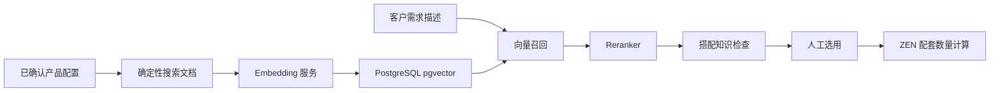

# 产品智能召回与候选排序

日期：2026-09-26

## 定位

智能检索只解决“从大量产品配置中找出可能相关的候选，并调整展示顺序”。它不确认兼容性，不计算辅材和授权数量，也不直接修改项目清单。

项目候选现在有三种模式：

- **已知候选**：沿用系统、角色和知识版本筛选。
- **智能查找**：Embedding 从已建立索引的配置中召回，Reranker 排序，然后继续执行现有搭配知识检查。
- **全部产品**：人工浏览全部配置。

最终顺序始终先按业务状态分组：已知通过、资料不足、明确冲突。模型高分不能把冲突变成通过，也不能越过已知通过的配置。

## 数据流



索引文档包含型号、产品名称、类别、品牌、配置、系列、功能、接口、适用系统和已确认的结构化属性。原始来源全文、价格和未确认备注不写入向量文本；来源证据仍保存在产品库并由业务检查结果引用。这样避免重复的长篇规格覆盖已整理事实，也控制本地 CPU 推理耗时。

## 数据和版本

新增两张表：

- `configuration_search_documents`：保存配置版本、文档摘要、模型、1024 维向量和失败信息。
- `configuration_search_index_jobs`：保存后台索引任务、进度和错误。

配置或来源内容变化时，状态接口会根据内容摘要显示“需要更新”。保存产品不会直接调用模型。维护者在“产品整理 → 智能索引”中手动创建任务，再由后台进程分批执行。

模型地址、模型名和密钥保存到 `data/private/search.json`。密钥不写入数据库、代码或浏览器持久存储，设置接口不回显密钥。

## 模型接口

Embedding 使用 OpenAI 风格请求。查询文本由后端按 Qwen3 官方格式加入检索指令，产品文档不加查询指令：

```json
{
  "model": "Qwen3-Embedding-0.6B",
  "input": ["产品检索文本"]
}
```

Reranker 使用常见的 `/rerank` 请求：

```json
{
  "model": "BAAI/bge-reranker-base",
  "query": "系统、角色和客户需求",
  "texts": ["候选产品文本"],
  "top_n": 20
}
```

服务必须返回全部输入的向量或排序分数。维度错误、缺少候选分数、超时和 HTTP 错误都会明确失败，不会换成型号字符串排序伪装成智能结果。

## 运行

数据库镜像已改为 `pgvector/pgvector:pg17`。升级现有环境：

```sh
docker compose pull database
docker compose up -d --force-recreate database
.venv/bin/pip install -e './backend[dev]'
.venv/bin/python scripts/migrate_configuration.py
```

首次启动本地检索模型会下载约 2.3GB 权重：

```sh
docker compose --profile search up -d search-embeddings search-models
```

后台私有配置 `data/private/search.json` 使用以下本机地址：

- Embedding：`http://127.0.0.1:18081/v1/embeddings`，模型 `Qwen/Qwen3-Embedding-0.6B`。
- Reranker：`http://127.0.0.1:18080/rerank`，模型 `BAAI/bge-reranker-base`。
- 固定维度 1024，单批 8 条，请求超时 300 秒。

启动索引工作进程：

```sh
.venv/bin/python -m presales.configuration.search.worker
```

模型服务和索引工作进程都属于可选的 `search` 运行部分。普通产品维护、已知候选、全部产品、搭配检查和项目计算不依赖模型服务；模型不可用时智能查找会明确报错。

## 接口

- `GET /api/configuration/search/settings`
- `PUT /api/configuration/search/settings`
- `POST /api/configuration/search/test`
- `GET /api/configuration/search/status`
- `GET /api/configuration/search/jobs`
- `POST /api/configuration/search/jobs`
- `POST /api/configuration/search/jobs/{job_id}/retry`
- `POST /api/configuration/candidates`，新增 `mode`、`query_text` 和 `limit`

旧候选请求继续兼容 `include_all`。

## 已验证

- 私有配置连接测试实际调用本机两个 TEI 服务，Embedding 返回 1024 维向量，Reranker 返回完整候选分数。
- 已确认的 163 个产品配置全部写入 PostgreSQL 17 + pgvector 0.8.6：可用 163、待建立 0、过期 0、失败 0。
- 真实中文需求“红盾无纸化会议系统、Windows、约 50 台终端”完成 50 条向量召回和重排，接口在本机 Intel CPU 上耗时约 29.5 秒；前列包含对应 Windows 服务端软件和无纸化会议主机。
- 业务检查继续生效：Linux 的 PCS-1516N 虽然语义分数高，但因 Windows 环境冲突进入“明确冲突”，没有被模型改写成适用。
- 原 Qwen3-Reranker-0.6B 的 50 条 CPU 重排超过 300 秒并明确超时，因此本地默认改为 TEI 原生支持的 BAAI/bge-reranker-base；没有缩减召回条数或降级成字符串排序。
- PostgreSQL 管线、模型接口契约、索引任务、内容过期和失败记录均有自动化测试；Ruff、TypeScript 与 Vite 生产构建通过。

## 尚未验证

当前真实单次查询约 30 秒，适合先做低并发售前试用，尚未完成多人并发和持续压力测试。真实中文需求的召回与排序仍需用售前案例持续评估；当前结果也显示服务端角色会召回相关客户端产品，必须继续依靠结构化搭配知识和人工确认。智能查找只生成候选，不能作为产品兼容性或报价依据。
